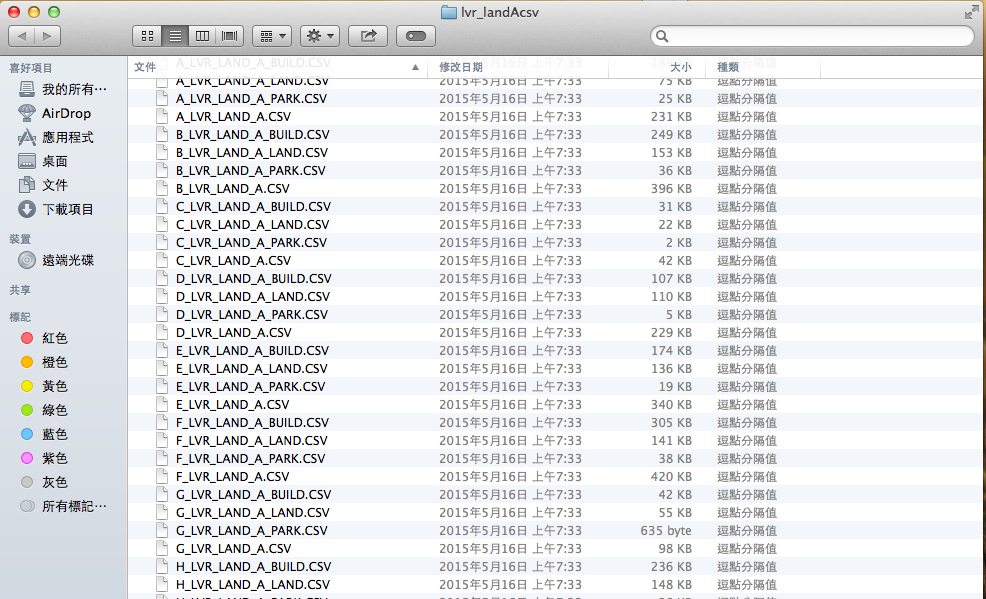

## 動機

透過<a href="http://data.gov.tw/">政府資料開放平台</a>，可下載到很多資料，如何應用需要靠我們的創意進行加值。
    

今天將說明如何彙整不動產實價登錄資料，透過視覺化的方式呈現
  - 檢視房地產價格漲跌
  - 房屋移轉量
  - 地理資訊視覺化
<br></br>
<br></br>    
    
資料來源網址：<a hrep="http://data.gov.tw/node/6213">http://data.gov.tw/node/6213</a>

--- &twocol
## R套件

*** =left
<span style="color:blue"  font-size: 12pt> 資料處理</span>
- dplyr
- stringr

<span style="color:blue"  font-size: 12pt> 時間序列</span>
- xts
- zoo

*** =right
<span style="color:blue"  font-size: 12pt> 動態繪圖</span>
- dygraphs
- googleVis
- plotGoogleMaps
- rCharts

--- .segue .quote .dark

<br></br>
<div align=center valign=center><q>資料前置處理</q></div>

<style>
.dark q {
  color: white;
}
</style>


---
## 資料很多，要如何一次將資料匯入R中?




---
## 不動產實價登錄資料載入-1
```{r, echo=FALSE}
library(knitr)
```

Setp 1 設定目錄
```{r}
path <- "~/Desktop/2015 DSIA workshop/lvr_landAcsv/"
setwd(path)
```

Setp 2 搜尋檔案路徑
```{r}
files <- dir(path, pattern="\\.CSV", recursive=TRUE, full.names=T)
files <- files[grepl("[A-Z]_LVR_LAND_A.CSV", files)]
```


---
## 不動產實價登錄資料載入-2

Setp 3 讀取資料
```{r, warning=FALSE}
tables <- lapply(1:length(files), 
                 function(u) read.csv(files[u], fileEncoding = "BIG-5", 
                                      stringsAsFactors = F, 
                                      colClasses = c(rep(NA, 26), rep("NULL", 10))))
```

- 輸出為list格式

<span style="color:red"  font-size: 14 pt>注意事項 </span>
> 1. 需注意檔案編碼
> 2. 由於「備註」一欄跨越多個欄位，導致每一筆資料長度不同，因此匯入時忽略備註後的欄位

---
## 不動產實價登錄資料載入-3

Step 4 加入縣市名稱

```{r}
corresponda <- read.table("~/Desktop/2015 DSIA workshop/lvr_landAcsv/地區對照.txt", 
                          header = T, stringsAsFactors = F)
city <- rep(corresponda[,2], unlist(lapply(tables,nrow)))
```

Step 5 合併資料

```{r}
tables <- do.call(rbind, tables)
Data <- data.frame("縣市" = city, tables)
```

---
## 寫成函數，方便新資料載入

```{r}
load_data <- function(path) {
  files <- dir(path, pattern="\\.CSV", recursive=TRUE, full.names=T)
  files <- files[grepl("[A-Z]_LVR_LAND_A.CSV", files)]
  
  tables <- lapply(1:length(files), 
                   function(u) read.csv(files[u], fileEncoding = "BIG-5", 
                                        stringsAsFactors = F, 
                                        colClasses = c(rep(NA, 26), rep("NULL", 10))))
  
  corresponda <- read.table("地區對照.txt", header = T, stringsAsFactors = F)
  
  city <- rep(corresponda[,2], unlist(lapply(tables,nrow)))
  tables <- do.call(rbind, tables)
  data.frame("縣市" = city, tables)
}
```

```{r, eval=FALSE}
Data <- load_data(path)
```

--- 

## 檢視資料結構

```{r}
str(Data)
```

---
## 資料中沒有提供經緯度怎麼辦？

- 可透過 Google Map API將地址轉換為經緯度

- 使用下列連結即可返還json格式的資料，透過解析json檔即可獲取坐標

    http：//maps.googleapis.com/maps/api/geocode/json?address=<span style="color:blue">地址</span>&sensor=true

<br></br>

- 在R中可使用ggmap套R件中的geocode獲取經緯度資訊

<span style="color:red">限制</span>
  - 查詢的次數上限為一天 2500 次

--- 
## 地址處理-1

因資料中的地址形態為

- 房地、車位：臺北市中山區南京東路二段181~210號
- 土地：實踐段二小段541~570地號

故在獲取經緯度前，先取得該地段中間的門牌號碼作為代表

```{r}
library(ggmap)
library(stringr)
```

---
## 地址處理-2

處理門牌號碼
```{r}
location <- "臺北市中山區南京東路二段181~210號"
if(grepl("~", location)){
        Replace<- str_locate(location, "[0-9]+~[0-9]+")
        Replace <- str_sub(location, Replace)[1]
        Replace<- gsub("號", "", Replace)
        No <- as.numeric(unlist(strsplit(Replace, "~")))
        No <- floor((No[2]+No[1])/2)
        No
        location <- str_replace(location, Replace, No)
      } 
location
```

---
## 地址處理-3

加入額外判斷條件並寫成函數

```{r}
location_process <- function(location){
  if( nchar(location)<3 | grepl("地號", location) | location == ""){
    ""
  }else{
    if(grepl("~", location)){
      Replace<- str_locate(location, "[0-9]+~[0-9]+")
      Replace <- str_sub(location, Replace)[1]
      Replace<- gsub("號", "", Replace)
      No <- as.numeric(unlist(strsplit(Replace, "~")))
      No <- floor((No[2]+No[1])/2)
      location <- str_replace(location, Replace, No)
    } 
    location
  }
}
```


--- 
## 地址處理-4

```{r, warning=FALSE}
Data$土地區段位置或建物區門牌 <- sapply(Data$土地區段位置或建物區門牌, location_process)
```

獲取經緯度

```{r, eval=FALSE}
geocode(location = Data$土地區段位置或建物區門牌[1])
```

```{r, eval=FALSE}
LatLon <- t(sapply(Data$土地區段位置或建物區門牌[1:2500], geocode)) 
LatLon <- as.data.frame(LatLon)
```

新增經緯度欄位
```{r, eval=FALSE}
Data$Lon <- LatLon$lon
Data$Lat <- LatLon$lat
```


---
```{r}
Data <- read.table("~/Desktop/2015 DSIA workshop/lvr_landAcsv/lvr_land_All.csv", 
                   header = T, sep = ",", stringsAsFactors = F)

Data[1:5, 28:29]
```

---
## 日期格式轉換-1

原先交易年月之日期格式為「民國年＋月份」--> 轉換為西元年月

```{r}
Data$交易年月[1:10]
```


<span style="color:red"  font-size: 14 pt>轉換前需將系統時間語系進行更改</span>

```{r}
if(Sys.info()[1]=="Windows"){
  Sys.setlocale("LC_TIME", "C")
}else{
  Sys.setlocale("LC_TIME", "en_US.UTF-8")
}
```

---
## 日期格式轉換-2

```{r}
Data <- Data[Data$交易標的 != "土地", ]

year <- as.numeric(ifelse(nchar(Data$交易年月)==5, str_sub(Data$交易年月, 1, 3), 
                          str_sub(Data$交易年月, 1, 2)))

year <- year+1911

mon <- ifelse(nchar(Data$交易年月)==5, str_sub(Data$交易年月, 4, 5), 
              str_sub(Data$交易年月, 3, 4))

library(zoo)
Data$交易年月 <- as.yearmon(paste0(year,"-", mon))

Data$yearmon <- as.Date(Data$交易年月)
Data$yearmon
```

--- .segue .quote .dark

<br></br>
<div align=center valign=center><q>互動式視覺化設計</q></div>

<style>
.dark q {
  color: white;
}
</style>

---
## 資料集呈現

```{r, results = 'asis'}
library(rCharts)
dTable(Data[1:10, 1:5])
```


---
## 土地使用區分
```{r}
library(dplyr); library(xts); library(dygraphs)
Data$Zoning <- ifelse(nchar(Data$都市土地使用分區) > 0, 
                      Data$都市土地使用分區, Data$非都市土地使用分區)
```

利用dygraphs產生交互式時間序列圖表

```{r}
colnames(Data)[1] <- "city"
df <- filter(Data, Data$yearmon >as.Date(as.yearmon("2014-01")),Zoning !="") %>%
      mutate(Year = yearmon, Zoning= 都市土地使用分區) %>%
      dplyr::select(Year, Zoning)

df <- aggregate(df$Zoning, list(df$Year), table)
df <- cbind(df[1], df[[2]])

DyGraph <- xts(df[,-1], order.by = df$Group.1) %>% 
  dygraph(main = "土地使用分區") %>% 
  dyRangeSelector %>% 
  dyLegend(width = 800,  showZeroValues = F)
```

```{r, echo=FALSE}
setwd("~/Desktop/2015 DSIA workshop/assets/html")
htmlwidgets::saveWidget(DyGraph, "DyGraph.html")
```

---

<span style="color:blue"  font-size: 14pt> dygraphs</span>
- 調用dygraphs JavaScriptk的圖庫
- 針對R中xts時間序列對象繪圖

<iframe src="assets/html/DyGraph.html" STYLE="width:100%;height:80%"> </iframe>

---
## 土地移轉量

計算每坪單價
```{r}
options("scipen"=100, "digits"=4)
Data$SFprice <- Data$總價元/Data$土地移轉總面積平方公尺
```

統計各月份成交件數與每坪平均單價
```{r}
Data2 <- Data[!Data$SFprice == Inf, ]
Data2 <- Data2[Data2$yearmon >as.Date(as.yearmon("2014-09")),]

MeanPrice <- aggregate(Data2$SFprice, list(Data2$交易年月), mean)
Trading <- aggregate(Data2$SFprice, list(Data2$交易年月), length)

TradingVolume <- data.frame(MeanPrice, Trading[2])
names(TradingVolume) <- c("Date", "Price", "quantity")

TradingVolume$Date <- as.character(TradingVolume$Date)
```

---
## Highcharts

```{r, results = 'asis'}
require(rCharts)
h <- Highcharts$new()

h$xAxis(categories = as.factor(TradingVolume$Date))

h$yAxis(list(list(title = list(text = '成交量')), 
             list(title = list(text = '每坪單價'),
                  opposite = TRUE)))

h$series(name = '成交量', type = 'column', color = '#4572A7',
         data = TradingVolume$quantity)

h$series(name = '每坪單價', type = 'spline', color = '#89A54E',
         data = as.integer(TradingVolume$Price), yAxis = 1)

```

```{r, echo=FALSE}
h$save('Highcharts.html', cdn = TRUE)
```

---
## Line plus Bar Chart
```{r, results = 'asis'}
h
```


---
## 各縣市不動產平均單價

用aggregate整合資料時，加入縣市進行統計
```{r}
MeanPrice <- aggregate(Data2$SFprice, list(Data2$交易年月, Data2$city), mean)
Trading <- aggregate(Data2$SFprice, list(Data2$交易年月, Data2$city), length)
TV<- merge(MeanPrice, Trading, c("Group.1", "Group.2"))
names(TV) <- c("Date", "location", "Price", "quantity")
TV <- TV[order(TV$Date),]
TV$Date <- as.character(TV$Date)
```

```{r}
TV
```

---
## NVD3

```{r}
n1 <- nPlot(Price ~ Date, 
            group = "location", 
            data = TV, 
            type = "multiBarChart")

n1$chart(showControls = F, margin = list(left = 130))
n1$yAxis(axisLabel = "平均單價", width = 100)
n1$xAxis(axisLabel = "年份")
```

- showControls用來決定是否顯示圖形控制選項(Grouped, Stacked)
- margin用來設定邊界


---
## 各縣市不動產平均單價長條圖

```{r, results = 'asis'}
n1
```


---
## 選項太多？將資料分組

Step 1 判斷各縣市屬於北部？南部？中部？東部？金馬？

```{r}
North <- c("臺北市", "新北市","基隆市","宜蘭縣","桃園市", "桃園縣", "新竹縣","新竹市")
South <- c("嘉義縣","嘉義市","臺南市","高雄市","屏東縣","澎湖縣")
Central <- c("苗栗縣","臺中市","彰化縣","南投縣","雲林縣")
East <- c("花蓮縣", "臺東縣")

TV$Area <- ifelse(TV$location %in% North, "北部",
                     ifelse(TV$location %in% South, "南部", 
                            ifelse(TV$location %in% Central, "中部",
                                   ifelse(TV$location %in% East, "東部", "金馬"))))
```

--- 
## addFilters

Step 2 於addFilters內放入變數名稱

```{r}
n2 <- nPlot(Price ~ Date, 
            group = "location", 
            data = TV, 
            type = "multiBarChart")

n2$chart(showControls = F, margin = list(left = 130))
n2$yAxis(axisLabel = "平均單價", width = 100)
n2$xAxis(axisLabel = "年份")
n2$addFilters("Area")
```
 

```{r, echo=FALSE}
n2$save('n2.html',cdn=TRUE)
```

---
加入過濾器進行篩選，更易於檢視資料

<iframe src="assets/html/n2.html" STYLE="width:130%;height:80%"> </iframe>


---
## 臺北市建物單價與坪數分佈

```{r, results = 'asis'}
Data2$BuildType <- sapply(strsplit( Data2$建物型態 , "[(]"), "[", 1)
SFdata <- Data2[Data2$city == "臺北市", ]
SFdata <- data.frame(SF = SFdata$建物移轉總面積平方公尺, SFprice = SFdata$SFprice, BuildType = SFdata$BuildType)
SFdata <- SFdata[!is.na(SFdata$BuildType), ]
nPlot(SFprice ~ SF, group = "BuildType", data = SFdata, type = 'scatterChart')
```


--- 
## Pie Chart

各類型建物之成交比例之圓餅圖
```{r}
BN <- aggregate(SFdata$BuildType, list(SFdata$BuildType), length)
names(BN) <- c("label", "value")
BN <- BN[order(BN$value),]
BN <- BN[-which(BN$label == "其他"), ]

Pie <- rCharts$new()
Pie$setLib("http://timelyportfolio.github.io/rChartsExtra/d3pie")
Pie$params$chartspec <- list(header = list(title = list(text = "成交建物類型"))
                             ,data = list(content = BN)
                             ,labels = list(lines = list(style = "straight")))
```

```{r, echo=FALSE}
# Pie$params$width <- 350
Pie$save('Pie.html',cdn=TRUE)
```

---
<iframe src="assets/html/Pie.html" STYLE="width:100%;height:100%"> </iframe>

---
## Horizontal Chart

各類建物成交單價
```{r}
Bprice <- aggregate(SFdata$SFprice, list(SFdata$BuildType), mean)
names(Bprice) <- c("label", "value")
Bprice<- Bprice[order(Bprice$value, decreasing = T),]
Bprice <- Bprice[-which(Bprice$label == "其他"), ]

n3 <- nPlot(value ~ label, data = Bprice, type = 'multiBarHorizontalChart', width = 800)
n3$chart(showControls = F, margin = list(left = 130))
n3$yAxis(axisLabel = "平均成交單價")
```

```{r, echo=FALSE}
n3$save('Horizontal.html',cdn=TRUE)
```

--- 

<iframe src="assets/html/Horizontal.html" STYLE="width:100%;height:100%"> </iframe>


---
## gvisMap

優點：可直接依照地址繪製地圖

缺點：資料筆數上限為400筆

```{r}
MapData <- Data2[sample(1:nrow(Data2), 50), ]
```

Tips用來建立地點資訊
```{r}
Tips <- sapply(1:50, function(u) paste0("地址：",MapData[u,4], 
                                        "<BR>面積：",MapData[u, 5], 
                                        "<BR>樓層：",MapData[u, 11],  
                                        "<BR>價格：", MapData[u, 23]))

df <- data.frame(Adress = MapData$土地區段位置或建物區門牌, Tips)

library(googleVis)
Map <- gvisMap(df, "Adress", "Tips", options = list(mapType = 'normal', width = 800, height = 650))
```

```{r,eval=FALSE}
plot(Map)
```


---

將地圖存為html後使用iframe讀進HTML Slide中
```{r}
print(Map, file="GvisMap.html")
```


<iframe src="assets/html/GvisMap.html" STYLE="width:120%;height:80%"></iframe>


---
## 重設定價格與經緯度

更改價格區間
```{r}
Data2$level <- ifelse(Data2$總價元 <= 10000000, "0~1000", 
                      ifelse(Data2$總價元 <= 20000000, "1000~2000", "2000+"))

table(Data2$level)
```

---
## 清理經緯度資料


```{r, eval=FALSE}
Data2 <- Data2[which(Data2$lat < 35 & Data2$lon > 119), ]
Data2 <- Data2[which(Data2$lat !="" | Data2$lon != ""), ]
# Data2[is.na(Data2)] <- ""
MapData2<- Data2[, c(34, 3,4,5, 23, 31:33, 28:29)]
MapData2 <- MapData2[Data2$交易年月==as.yearmon("2015-01"), ]
```

---

## 建立空間資料

```{r}
library(plotGoogleMaps)
```

設定空間坐標
```{r, eval=FALSE}
coordinates(MapData2)<- ~lon+lat
```

指定空間投影的參考系統
```{r, eval=FALSE}
proj4string(MapData2) <- CRS("+init=epsg:4326")
```

> epsg 4326地區為世界地圖

---
## plotGoogleMaps

```{r, eval=FALSE}
m <- plotGoogleMaps(MapData2,filename='Map1.html',mapTypeId= "ROADMAP")
```

<iframe src="assets/html/Map1.html"> </iframe>

---
## bubbleGoogleMaps

```{r, eval=FALSE}
m2 <- bubbleGoogleMaps(MapData2,zcol='總價元', max.radius=500
                       , filename='Map2.html')
```

<iframe src="assets/html/Map2.html"> </iframe>


---
## mcGoogleMaps

```{r, eval=FALSE}
m3 <- mcGoogleMaps(MapData2, zcol='SFprice', filename='Map3.html')
```

<iframe src="assets/html/Map3.html"> </iframe>


--- .segue .lightblue

<br></br>
<div align=center valign=center><q>Thanks for your attention</q></div>
<br></br>

<style>
.white q {
  color: black;
}
</style>
