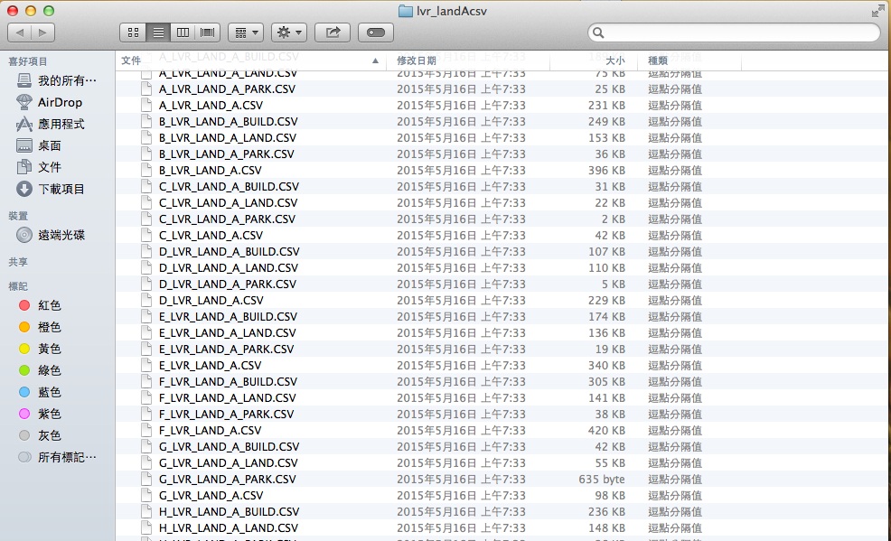
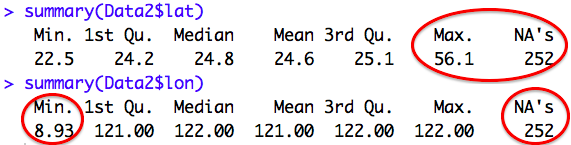

## 動機

透過<a href="http://data.gov.tw/">政府資料開放平台</a>，可下載到很多資料，如何應用需要靠我們的創意進行加值。
    

今天將說明如何彙整不動產實價登錄資料，透過視覺化的方式呈現
  - 檢視房地產價格漲跌
  - 房屋移轉量
  - 地理資訊視覺化
<br></br>
<br></br>    
    
資料來源網址：<a hrep="http://data.gov.tw/node/6213">http://data.gov.tw/node/6213</a>

--- &twocol
## R套件

*** =left
<span style="color:blue"  font-size: 12pt> 資料處理</span>
- dplyr
- stringr

<span style="color:blue"  font-size: 12pt> 時間序列</span>
- xts
- zoo

*** =right
<span style="color:blue"  font-size: 12pt> 動態繪圖</span>
- dygraphs
- googleVis
- plotGoogleMaps
- rCharts

--- .segue .quote .dark

<br></br>
<div align=center valign=center><q>資料前置處理</q></div>

<style>
.dark q {
  color: white;
}
</style>


---
## 資料很多，要如何一次將資料匯入R中?




---
## 不動產實價登錄資料載入-1


Setp 1 設定目錄

```r
path <- "~/Desktop/2015 DSIA workshop/lvr_landAcsv/"
setwd(path)
```

Setp 2 搜尋檔案路徑

```r
files <- dir(path, pattern="\\.CSV", recursive=TRUE, full.names=T)
files <- files[grepl("[A-Z]_LVR_LAND_A.CSV", files)]
```


---
## 不動產實價登錄資料載入-2

Setp 3 讀取資料

```r
tables <- lapply(1:length(files), 
                 function(u) read.csv(files[u], fileEncoding = "BIG-5", 
                                      stringsAsFactors = F, 
                                      colClasses = c(rep(NA, 26), rep("NULL", 10))))
```

- 輸出為list格式

<span style="color:red"  font-size: 14 pt>注意事項 </span>
> 1. 需注意檔案編碼
> 2. 由於「備註」一欄跨越多個欄位，導致每一筆資料長度不同，因此匯入時忽略備註後的欄位

---
## 不動產實價登錄資料載入-3

Step 4 加入縣市名稱


```r
corresponda <- read.table("~/Desktop/2015 DSIA workshop/lvr_landAcsv/地區對照.txt", 
                          header = T, stringsAsFactors = F)
city <- rep(corresponda[,2], unlist(lapply(tables,nrow)))
```

Step 5 合併資料


```r
tables <- do.call(rbind, tables)
Data <- data.frame("縣市" = city, tables)
```

---
## 寫成函數，方便新資料載入


```r
load_data <- function(path) {
  files <- dir(path, pattern="\\.CSV", recursive=TRUE, full.names=T)
  files <- files[grepl("[A-Z]_LVR_LAND_A.CSV", files)]
  
  tables <- lapply(1:length(files), 
                   function(u) read.csv(files[u], fileEncoding = "BIG-5", 
                                        stringsAsFactors = F, 
                                        colClasses = c(rep(NA, 26), rep("NULL", 10))))
  
  corresponda <- read.table("地區對照.txt", header = T, stringsAsFactors = F)
  
  city <- rep(corresponda[,2], unlist(lapply(tables,nrow)))
  tables <- do.call(rbind, tables)
  data.frame("縣市" = city, tables)
}
```


```r
Data <- load_data(path)
```

--- 

## 檢視資料結構


```r
str(Data)
```

```
## 'data.frame':	4077 obs. of  27 variables:
##  $ 縣市                    : Factor w/ 21 levels "高雄市","花蓮縣",..: 11 11 11 11 11 11 11 11 11 11 ...
##  $ 鄉鎮市區                : chr  "文山區" "中正區" "文山區" "文山區" ...
##  $ 交易標的                : chr  "房地(土地+建物)" "房地(土地+建物)" "房地(土地+建物)+車位" "車位" ...
##  $ 土地區段位置或建物區門牌: chr  "臺北市文山區景華街82巷7弄1~30號" "臺北市中正區羅斯福路二段31~60號" "臺北市文山區萬芳路107巷1~30號" "臺北市文山區興隆路三段181巷61~90號" ...
##  $ 土地移轉總面積平方公尺  : num  28.67 11.45 41.23 0.7 9.16 ...
##  $ 都市土地使用分區        : chr  "住" "商" "住" "住" ...
##  $ 非都市土地使用分區      : chr  NA NA NA NA ...
##  $ 非都市土地使用編定      : chr  NA NA NA NA ...
##  $ 交易年月                : int  10402 10402 10401 10402 10401 10403 10403 10403 10403 10403 ...
##  $ 交易筆棟數              : chr  "土地1建物1車位0" "土地1建物1車位0" "土地1建物1車位2" "土地0建物0車位1" ...
##  $ 移轉層次                : chr  "一層" "三層" "五層" "" ...
##  $ 總樓層數                : int  3 9 15 NA 16 NA NA NA NA NA ...
##  $ 建物型態                : chr  "公寓(5樓含以下無電梯)" "華廈(10層含以下有電梯)" "住宅大樓(11層含以上有電梯)" "其他" ...
##  $ 主要用途                : chr  "住家用" "見使用執照" "見其他登記事項" "" ...
##  $ 主要建材                : chr  "鋼筋混凝土造" "鋼筋混凝土造" "鋼筋混凝土造" "" ...
##  $ 建築完成年月            : int  730521 700623 1010919 NA 880119 NA NA NA NA NA ...
##  $ 建物移轉總面積平方公尺  : num  50.2 108.2 254.4 35.6 41.3 ...
##  $ 建物現況格局.房         : int  2 3 3 0 3 0 0 0 0 0 ...
##  $ 建物現況格局.廳         : int  2 2 2 0 1 0 0 0 0 0 ...
##  $ 建物現況格局.衛         : int  2 2 2 0 2 0 0 0 0 0 ...
##  $ 建物現況格局.隔間       : chr  "有" "有" "有" "有" ...
##  $ 有無管理組織            : chr  "無" "有" "有" "有" ...
##  $ 總價元                  : num  12000000 17800000 37500000 2000000 2274651 ...
##  $ 單價每平方公尺          : int  239091 164510 147423 NA 55090 238976 238404 238785 238404 0 ...
##  $ 車位類別                : chr  "" "" "坡道平面" "坡道平面" ...
##  $ 車位移轉總面積平方公尺  : num  0 0 68.5 35.6 0 ...
##  $ 車位總價元              : int  0 0 0 2000000 0 0 0 0 0 0 ...
```

---
## 資料中沒有提供經緯度怎麼辦？

- 可透過 Google Map API將地址轉換為經緯度

- 使用下列連結即可返還json格式的資料，透過解析json檔即可獲取坐標

    http：//maps.googleapis.com/maps/api/geocode/json?address=<span style="color:blue">地址</span>&sensor=true

<br></br>

- 在R中可使用ggmap套R件中的geocode獲取經緯度資訊

<span style="color:red">限制</span>
  - 查詢的次數上限為一天 2500 次

--- 
## 地址處理-1

因資料中的地址形態為

- 房地、車位：臺北市中山區南京東路二段181~210號
- 土地：實踐段二小段541~570地號

故在獲取經緯度前，先取得該地段中間的門牌號碼作為代表


```r
library(ggmap)
library(stringr)
```

---
## 地址處理-2

處理門牌號碼

```r
location <- "臺北市中山區南京東路二段181~210號"
if(grepl("~", location)){
        Replace<- str_locate(location, "[0-9]+~[0-9]+")
        Replace <- str_sub(location, Replace)[1]
        Replace<- gsub("號", "", Replace)
        No <- as.numeric(unlist(strsplit(Replace, "~")))
        No <- floor((No[2]+No[1])/2)
        No
        location <- str_replace(location, Replace, No)
      } 
location
```

```
## [1] "臺北市中山區南京東路二段195號"
```

---
## 地址處理-3

加入額外判斷條件並寫成函數


```r
location_process <- function(location){
  if( nchar(location)<3 | grepl("地號", location) | location == ""){
    ""
  }else{
    if(grepl("~", location)){
      Replace<- str_locate(location, "[0-9]+~[0-9]+")
      Replace <- str_sub(location, Replace)[1]
      Replace<- gsub("號", "", Replace)
      No <- as.numeric(unlist(strsplit(Replace, "~")))
      No <- floor((No[2]+No[1])/2)
      location <- str_replace(location, Replace, No)
    } 
    location
  }
}
```


--- 
## 地址處理-4


```r
Data$土地區段位置或建物區門牌 <- sapply(Data$土地區段位置或建物區門牌, location_process)
```

獲取經緯度


```r
geocode(location = Data$土地區段位置或建物區門牌[1])
```


```r
LatLon <- t(sapply(Data$土地區段位置或建物區門牌[1:2500], geocode)) 
LatLon <- as.data.frame(LatLon)
```

新增經緯度欄位

```r
Data$Lon <- LatLon$lon
Data$Lat <- LatLon$lat
```


---

```r
Data <- read.table("~/Desktop/2015 DSIA workshop/lvr_landAcsv/lvr_land_All.csv", 
                   header = T, sep = ",", stringsAsFactors = F)

Data[1:5, 28:29]
```

```
##     lat   lon
## 1 24.99 121.5
## 2 25.03 121.5
## 3 25.00 121.6
## 4 25.00 121.6
## 5 25.00 121.5
```

---
## 日期格式轉換-1

原先交易年月之日期格式為「民國年＋月份」--> 轉換為西元年月


```r
Data$交易年月[1:10]
```

```
##  [1] 10402 10402 10401 10402 10401 10403 10403 10403 10403 10403
```


<span style="color:red"  font-size: 14 pt>轉換前需將系統時間語系進行更改</span>


```r
if(Sys.info()[1]=="Windows"){
  Sys.setlocale("LC_TIME", "C")
}else{
  Sys.setlocale("LC_TIME", "en_US.UTF-8")
}
```

```
## [1] "en_US.UTF-8"
```

---
## 日期格式轉換-2


```r
Data <- Data[Data$交易標的 != "土地", ]

year <- as.numeric(ifelse(nchar(Data$交易年月)==5, str_sub(Data$交易年月, 1, 3), 
                          str_sub(Data$交易年月, 1, 2)))

year <- year+1911

mon <- ifelse(nchar(Data$交易年月)==5, str_sub(Data$交易年月, 4, 5), 
              str_sub(Data$交易年月, 3, 4))

library(zoo)
Data$交易年月 <- as.yearmon(paste0(year,"-", mon))

Data$yearmon <- as.Date(Data$交易年月)
Data$yearmon
```

```
##    [1] "2015-02-01" "2015-02-01" "2015-01-01" "2015-02-01" "2015-01-01"
##    [6] "2015-01-01" "2015-02-01" "2015-01-01" "2015-02-01" "2015-02-01"
##   [11] "2015-02-01" "2015-02-01" "2015-02-01" "2015-02-01" "2015-03-01"
##   [16] "2015-02-01" "2015-01-01" "2015-01-01" "2014-08-01" "2015-03-01"
##   [21] "2015-02-01" "2015-03-01" "2015-02-01" "2015-01-01" "2014-11-01"
##   [26] "2014-12-01" "2015-01-01" "2014-12-01" "2014-12-01" "2015-01-01"
##   [31] "2015-02-01" "2015-02-01" "2014-12-01" "2015-03-01" "2015-03-01"
##   [36] "2015-02-01" "2015-02-01" "2015-03-01" "2014-12-01" "2015-01-01"
##   [41] "2015-02-01" "2015-02-01" "2015-01-01" "2015-02-01" "2015-02-01"
##   [46] "2015-03-01" "2014-12-01" "2015-03-01" "2015-03-01" "2015-03-01"
##   [51] "2014-12-01" "2015-02-01" "2015-01-01" "2015-02-01" "2015-01-01"
##   [56] "2015-01-01" "2015-01-01" "2015-02-01" "2015-02-01" "2015-01-01"
##   [61] "2014-01-01" "2015-03-01" "2014-12-01" "2015-01-01" "2015-01-01"
##   [66] "2015-01-01" "2015-02-01" "2015-01-01" "2015-02-01" "2014-12-01"
##   [71] "2015-02-01" "2015-02-01" "2014-10-01" "2015-01-01" "2014-12-01"
##   [76] "2015-01-01" "2014-12-01" "2015-02-01" "2015-03-01" "2014-12-01"
##   [81] "2015-01-01" "2015-02-01" "2015-01-01" "2015-02-01" "2015-02-01"
##   [86] "2015-01-01" "2015-02-01" "2015-01-01" "2015-02-01" "2015-01-01"
##   [91] "2015-02-01" "2014-12-01" "2014-12-01" "2015-01-01" "2014-12-01"
##   [96] "2014-12-01" "2015-03-01" "2014-12-01" "2015-01-01" "2015-02-01"
##  [101] "2014-12-01" "2015-03-01" "2015-03-01" "2015-02-01" "2015-02-01"
##  [106] "2015-02-01" "2015-01-01" "2015-02-01" "2013-06-01" "2015-02-01"
##  [111] "2015-02-01" "2015-01-01" "2014-12-01" "2015-01-01" "2014-10-01"
##  [116] "2015-02-01" "2015-02-01" "2014-12-01" "2015-02-01" "2015-01-01"
##  [121] "2015-01-01" "2015-03-01" "2015-03-01" "2014-12-01" "2015-02-01"
##  [126] "2014-11-01" "2015-02-01" "2014-12-01" "2014-12-01" "2015-03-01"
##  [131] "2015-02-01" "2015-01-01" "2015-01-01" "2014-12-01" "2015-02-01"
##  [136] "2015-01-01" "2015-02-01" "2014-12-01" "2015-01-01" "2015-02-01"
##  [141] "2015-02-01" "2015-02-01" "2015-03-01" "2015-02-01" "2015-03-01"
##  [146] "2015-03-01" "2015-01-01" "2014-12-01" "2015-01-01" "2015-01-01"
##  [151] "2015-02-01" "2012-04-01" "2012-04-01" "2015-02-01" "2015-01-01"
##  [156] "2015-02-01" "2015-02-01" "2015-02-01" "2015-02-01" "2015-01-01"
##  [161] "2015-02-01" "2014-11-01" "2013-02-01" "2013-02-01" "2013-02-01"
##  [166] "2015-03-01" "2015-01-01" "2015-01-01" "2015-02-01" "2015-02-01"
##  [171] "2015-01-01" "2014-12-01" "2014-10-01" "2015-02-01" "2015-02-01"
##  [176] "2015-02-01" "2015-01-01" "2015-01-01" "2015-02-01" "2015-02-01"
##  [181] "2015-02-01" "2015-02-01" "2015-01-01" "2014-12-01" "2015-01-01"
##  [186] "2015-01-01" "2015-02-01" "2015-02-01" "2014-12-01" "2015-02-01"
##  [191] "2013-09-01" "2011-08-01" "2015-03-01" "2014-11-01" "2014-11-01"
##  [196] "2015-02-01" "2015-02-01" "2015-03-01" "2015-03-01" "2015-02-01"
##  [201] "2015-01-01" "2015-01-01" "2015-03-01" "2015-02-01" "2015-02-01"
##  [206] "2015-03-01" "2015-03-01" "2015-01-01" "2015-02-01" "2015-03-01"
##  [211] "2015-03-01" "2015-01-01" "2015-02-01" "2015-02-01" "2014-12-01"
##  [216] "2014-12-01" "2015-02-01" "2015-01-01" "2015-02-01" "2015-02-01"
##  [221] "2014-12-01" "2014-12-01" "2014-12-01" "2014-12-01" "2014-12-01"
##  [226] "2014-12-01" "2014-12-01" "2014-12-01" "2014-12-01" "2014-12-01"
##  [231] "2014-12-01" "2014-12-01" "2015-02-01" "2015-01-01" "2014-12-01"
##  [236] "2015-03-01" "2015-01-01" "2015-01-01" "2015-01-01" "2015-01-01"
##  [241] "2015-02-01" "2015-02-01" "2015-02-01" "2015-01-01" "2015-03-01"
##  [246] "2015-01-01" "2015-02-01" "2015-02-01" "2015-01-01" "2015-01-01"
##  [251] "2014-12-01" "2015-02-01" "2015-01-01" "2015-02-01" "2015-02-01"
##  [256] "2015-03-01" "2014-12-01" "2015-02-01" "2015-02-01" "2015-01-01"
##  [261] "2015-02-01" "2015-02-01" "2015-02-01" "2015-01-01" "2015-02-01"
##  [266] "2014-12-01" "2014-11-01" "2015-01-01" "2015-03-01" "2015-01-01"
##  [271] "2015-03-01" "2015-03-01" "2015-02-01" "2015-02-01" "2015-03-01"
##  [276] "2015-01-01" "2015-02-01" "2014-12-01" "2015-02-01" "2015-02-01"
##  [281] "2015-03-01" "2014-12-01" "2015-02-01" "2014-12-01" "2015-02-01"
##  [286] "2015-02-01" "2015-02-01" "2014-12-01" "2015-02-01" "2015-03-01"
##  [291] "2015-02-01" "2015-03-01" "2015-03-01" "2015-03-01" "2015-03-01"
##  [296] "2015-03-01" "2014-12-01" "2012-11-01" "2014-12-01" "2015-03-01"
##  [301] "2015-01-01" "2015-02-01" "2015-03-01" "2015-03-01" "2015-02-01"
##  [306] "2015-03-01" "2015-03-01" "2015-03-01" "2015-02-01" "2015-03-01"
##  [311] "2015-03-01" "2015-02-01" "2014-12-01" "2014-12-01" "2014-12-01"
##  [316] "2014-12-01" "2015-03-01" "2014-10-01" "2014-12-01" "2015-02-01"
##  [321] "2015-03-01" "2015-03-01" "2015-02-01" "2014-12-01" "2015-02-01"
##  [326] "2015-03-01" "2015-01-01" "2015-02-01" "2015-01-01" "2015-01-01"
##  [331] "2014-12-01" "2015-01-01" "2014-12-01" "2014-12-01" "2015-01-01"
##  [336] "2015-01-01" "2015-01-01" "2015-02-01" "2015-02-01" "2015-03-01"
##  [341] "2014-12-01" "2014-12-01" "2015-02-01" "2014-12-01" "2015-02-01"
##  [346] "2015-02-01" "2015-01-01" "2015-02-01" "2015-02-01" "2015-02-01"
##  [351] "2015-02-01" "2014-12-01" "2015-01-01" "2015-01-01" "2015-01-01"
##  [356] "2015-02-01" "2014-11-01" "2015-02-01" "2015-01-01" "2015-02-01"
##  [361] "2015-03-01" "2015-02-01" "2014-12-01" "2015-02-01" "2015-03-01"
##  [366] "2015-01-01" "2015-02-01" "2015-03-01" "2015-03-01" "2015-03-01"
##  [371] "2015-03-01" "2015-02-01" "2015-03-01" "2015-02-01" "2015-01-01"
##  [376] "2015-01-01" "2015-02-01" "2015-01-01" "2015-02-01" "2015-02-01"
##  [381] "2015-02-01" "2015-03-01" "2014-12-01" "2015-02-01" "2014-12-01"
##  [386] "2014-12-01" "2015-02-01" "2015-01-01" "2015-02-01" "2015-01-01"
##  [391] "2015-02-01" "2014-12-01" "2015-01-01" "2015-02-01" "2015-02-01"
##  [396] "2015-01-01" "2015-03-01" "2015-02-01" "2015-02-01" "2015-01-01"
##  [401] "2014-12-01" "2015-03-01" "2015-01-01" "2015-03-01" "2015-02-01"
##  [406] "2015-03-01" "2015-03-01" "2015-03-01" "2015-03-01" "2015-02-01"
##  [411] "2015-02-01" "2015-03-01" "2015-02-01" "2015-02-01" "2015-02-01"
##  [416] "2015-03-01" "2015-03-01" "2015-02-01" "2015-02-01" "2015-02-01"
##  [421] "2015-01-01" "2014-11-01" "2015-03-01" "2015-02-01" "2015-03-01"
##  [426] "2015-01-01" "2014-12-01" "2015-01-01" "2015-02-01" "2015-03-01"
##  [431] "2015-03-01" "2014-12-01" "2015-01-01" "2014-12-01" "2015-02-01"
##  [436] "2015-02-01" "2015-02-01" "2015-02-01" "2015-02-01" "2014-12-01"
##  [441] "2014-12-01" "2014-12-01" "2015-01-01" "2015-03-01" "2015-03-01"
##  [446] "2015-03-01" "2015-02-01" "2015-02-01" "2015-02-01" "2015-01-01"
##  [451] "2015-02-01" "2015-01-01" "2015-03-01" "2015-01-01" "2015-02-01"
##  [456] "2015-02-01" "2015-03-01" "2015-01-01" "2015-02-01" "2014-12-01"
##  [461] "2014-12-01" "2014-12-01" "2014-12-01" "2014-12-01" "2014-12-01"
##  [466] "2015-03-01" "2015-02-01" "2015-01-01" "2015-03-01" "2015-02-01"
##  [471] "2015-03-01" "2015-03-01" "2015-03-01" "2015-03-01" "2015-03-01"
##  [476] "2014-12-01" "2015-02-01" "2015-02-01" "2015-03-01" "2015-03-01"
##  [481] "2015-03-01" "2015-03-01" "2015-02-01" "2015-01-01" "2015-01-01"
##  [486] "2015-03-01" "2015-02-01" "2015-02-01" "2014-12-01" "2015-01-01"
##  [491] "2015-03-01" "2015-02-01" "2015-02-01" "2015-02-01" "2015-02-01"
##  [496] "2013-09-01" "2013-09-01" "2014-11-01" "2013-11-01" "2014-08-01"
##  [501] "2015-02-01" "2015-01-01" "2015-03-01" "2015-01-01" "2015-03-01"
##  [506] "2014-12-01" "2015-03-01" "2014-12-01" "2015-02-01" "2015-03-01"
##  [511] "2015-02-01" "2015-03-01" "2015-02-01" "2015-01-01" "2015-03-01"
##  [516] "2015-01-01" "2015-02-01" "2015-01-01" "2015-02-01" "2015-01-01"
##  [521] "2015-02-01" "2015-01-01" "2015-02-01" "2014-12-01" "2015-02-01"
##  [526] "2015-01-01" "2014-12-01" "2015-02-01" "2015-03-01" "2015-01-01"
##  [531] "2015-01-01" "2015-03-01" "2015-02-01" "2015-02-01" "2014-12-01"
##  [536] "2014-12-01" "2015-02-01" "2015-02-01" "2015-02-01" "2014-11-01"
##  [541] "2015-03-01" "2010-11-01" "2015-03-01" "2014-08-01" "2014-02-01"
##  [546] "2015-03-01" "2015-02-01" "2015-02-01" "2015-02-01" "2015-02-01"
##  [551] "2015-02-01" "2015-03-01" "2015-02-01" "2014-12-01" "2015-03-01"
##  [556] "2015-02-01" "2015-03-01" "2015-03-01" "2015-02-01" "2015-03-01"
##  [561] "2015-03-01" "2014-12-01" "2015-03-01" "2015-03-01" "2015-03-01"
##  [566] "2015-02-01" "2015-01-01" "2015-02-01" "2015-03-01" "2015-02-01"
##  [571] "2015-01-01" "2014-12-01" "2014-12-01" "2015-03-01" "2015-01-01"
##  [576] "2015-02-01" "2015-03-01" "2015-01-01" "2012-10-01" "2013-03-01"
##  [581] "2015-02-01" "2015-02-01" "2015-03-01" "2015-01-01" "2015-02-01"
##  [586] "2015-01-01" "2015-03-01" "2014-12-01" "2015-01-01" "2015-03-01"
##  [591] "2015-02-01" "2014-12-01" "2014-12-01" "2014-12-01" "2015-02-01"
##  [596] "2015-02-01" "2015-03-01" "2015-02-01" "2015-01-01" "2015-02-01"
##  [601] "2015-01-01" "2015-03-01" "2015-03-01" "2015-03-01" "2015-01-01"
##  [606] "2015-02-01" "2015-03-01" "2015-02-01" "2015-03-01" "2015-03-01"
##  [611] "2015-03-01" "2015-02-01" "2015-03-01" "2015-03-01" "2015-02-01"
##  [616] "2015-02-01" "2015-03-01" "2015-02-01" "2015-02-01" "2015-02-01"
##  [621] "2015-02-01" "2015-03-01" "2015-01-01" "2015-01-01" "2015-03-01"
##  [626] "2015-01-01" "2015-02-01" "2015-01-01" "2015-03-01" "2015-02-01"
##  [631] "2015-03-01" "2015-03-01" "2014-12-01" "2015-02-01" "2014-12-01"
##  [636] "2015-03-01" "2015-03-01" "2015-02-01" "2015-02-01" "2015-03-01"
##  [641] "2015-03-01" "2015-03-01" "2015-02-01" "2015-03-01" "2015-02-01"
##  [646] "2015-01-01" "2014-10-01" "2014-10-01" "2014-12-01" "2012-10-01"
##  [651] "2014-12-01" "2014-10-01" "2014-10-01" "2015-01-01" "2015-02-01"
##  [656] "2015-02-01" "2014-12-01" "2015-01-01" "2015-01-01" "2015-02-01"
##  [661] "2015-01-01" "2015-01-01" "2015-02-01" "2015-02-01" "2015-03-01"
##  [666] "2015-02-01" "2015-03-01" "2015-03-01" "2015-03-01" "2015-01-01"
##  [671] "2015-01-01" "2015-03-01" "2014-12-01" "2014-12-01" "2015-02-01"
##  [676] "2015-01-01" "2015-01-01" "2015-01-01" "2015-02-01" "2015-03-01"
##  [681] "2015-03-01" "2015-02-01" "2015-01-01" "2015-03-01" "2015-02-01"
##  [686] "2015-03-01" "2015-02-01" "2015-01-01" "2015-03-01" "2015-02-01"
##  [691] "2015-03-01" "2015-02-01" "2015-02-01" "2015-02-01" "2015-01-01"
##  [696] "2015-02-01" "2015-03-01" "2015-02-01" "2014-12-01" "2015-03-01"
##  [701] "2015-02-01" "2015-03-01" "2015-01-01" "2015-03-01" "2014-12-01"
##  [706] "2015-02-01" "2015-03-01" "2015-03-01" "2015-03-01" "2015-02-01"
##  [711] "2015-03-01" "2014-12-01" "2015-02-01" "2015-02-01" "2015-03-01"
##  [716] "2015-02-01" "2015-03-01" "2015-02-01" "2015-01-01" "2015-02-01"
##  [721] "2015-01-01" "2015-01-01" "2015-02-01" "2015-02-01" "2015-02-01"
##  [726] "2015-02-01" "2015-03-01" "2015-03-01" "2015-01-01" "2015-03-01"
##  [731] "2015-03-01" "2015-03-01" "2015-01-01" "2015-02-01" "2015-03-01"
##  [736] "2015-02-01" "2015-03-01" "2015-01-01" "2015-02-01" "2014-12-01"
##  [741] "2015-03-01" "2015-03-01" "2015-03-01" "2015-02-01" "2015-02-01"
##  [746] "2015-02-01" "2015-01-01" "2015-01-01" "2015-02-01" "2015-03-01"
##  [751] "2015-02-01" "2015-02-01" "2015-02-01" "2015-01-01" "2014-12-01"
##  [756] "2015-02-01" "2015-02-01" "2015-03-01" "2015-03-01" "2015-03-01"
##  [761] "2015-02-01" "2015-03-01" "2015-03-01" "2015-01-01" "2015-02-01"
##  [766] "2014-12-01" "2010-08-01" "2015-02-01" "2015-03-01" "2015-02-01"
##  [771] "2015-01-01" "2015-03-01" "2015-03-01" "2015-02-01" "2015-03-01"
##  [776] "2015-03-01" "2015-01-01" "2014-12-01" "2015-03-01" "2015-01-01"
##  [781] "2015-03-01" "2015-02-01" "2014-12-01" "2015-03-01" "2015-03-01"
##  [786] "2015-02-01" "2015-03-01" "2015-02-01" "2015-02-01" "2015-03-01"
##  [791] "2015-03-01" "2015-02-01" "2015-02-01" "2015-01-01" "2015-02-01"
##  [796] "2015-02-01" "2014-12-01" "2015-02-01" "2014-12-01" "2015-03-01"
##  [801] "2015-03-01" "2015-03-01" "2015-03-01" "2015-03-01" "2015-02-01"
##  [806] "2015-02-01" "2015-03-01" "2014-12-01" "2015-02-01" "2014-12-01"
##  [811] "2015-02-01" "2015-01-01" "2015-02-01" "2014-11-01" "2015-02-01"
##  [816] "2015-02-01" "2015-01-01" "2015-03-01" "2015-02-01" "2015-03-01"
##  [821] "2015-02-01" "2015-01-01" "2015-01-01" "2015-02-01" "2015-01-01"
##  [826] "2015-02-01" "2015-03-01" "2015-01-01" "2015-02-01" "2015-03-01"
##  [831] "2015-02-01" "2015-03-01" "2015-02-01" "2015-02-01" "2011-09-01"
##  [836] "2011-09-01" "2011-09-01" "2011-09-01" "2011-10-01" "2011-09-01"
##  [841] "2011-09-01" "2011-11-01" "2011-08-01" "2011-08-01" "2015-01-01"
##  [846] "2015-01-01" "2015-03-01" "2015-03-01" "2015-02-01" "2015-03-01"
##  [851] "2015-02-01" "2015-02-01" "2015-02-01" "2015-03-01" "2015-02-01"
##  [856] "2015-02-01" "2015-02-01" "2014-09-01" "2014-03-01" "2015-01-01"
##  [861] "2014-03-01" "2015-02-01" "2010-11-01" "2015-03-01" "2015-01-01"
##  [866] "2015-03-01" "2015-03-01" "2015-01-01" "2015-02-01" "2015-02-01"
##  [871] "2015-02-01" "2015-03-01" "2015-02-01" "2015-02-01" "2015-02-01"
##  [876] "2015-02-01" "2015-02-01" "2015-02-01" "2015-03-01" "2015-01-01"
##  [881] "2015-03-01" "2015-03-01" "2015-03-01" "2015-03-01" "2015-02-01"
##  [886] "2015-03-01" "2015-02-01" "2015-01-01" "2014-12-01" "2015-03-01"
##  [891] "2015-03-01" "2015-03-01" "2015-02-01" "2015-03-01" "2015-02-01"
##  [896] "2015-02-01" "2015-03-01" "2015-01-01" "2014-12-01" "2015-02-01"
##  [901] "2015-03-01" "2015-01-01" "2015-03-01" "2015-02-01" "2015-01-01"
##  [906] "2015-02-01" "2015-01-01" "2015-02-01" "2015-02-01" "2015-03-01"
##  [911] "2015-03-01" "2015-02-01" "2014-12-01" "2015-03-01" "2015-03-01"
##  [916] "2015-02-01" "2015-02-01" "2015-03-01" "2015-03-01" "2015-03-01"
##  [921] "2015-01-01" "2014-12-01" "2015-03-01" "2015-03-01" "2015-03-01"
##  [926] "2015-01-01" "2015-02-01" "2015-02-01" "2015-02-01" "2015-03-01"
##  [931] "2015-03-01" "2015-03-01" "2015-03-01" "2015-03-01" "2015-03-01"
##  [936] "2015-03-01" "2014-12-01" "2015-01-01" "2014-12-01" "2015-01-01"
##  [941] "2015-02-01" "2015-03-01" "2015-02-01" "2015-01-01" "2015-03-01"
##  [946] "2015-02-01" "2015-03-01" "2014-12-01" "2015-03-01" "2015-03-01"
##  [951] "2015-03-01" "2015-03-01" "2015-03-01" "2015-01-01" "2015-03-01"
##  [956] "2015-02-01" "2015-03-01" "2015-03-01" "2015-01-01" "2015-03-01"
##  [961] "2015-02-01" "2015-03-01" "2015-03-01" "2015-03-01" "2015-01-01"
##  [966] "2015-01-01" "2015-01-01" "2013-09-01" "2013-07-01" "2013-07-01"
##  [971] "2015-02-01" "2015-01-01" "2015-02-01" "2015-02-01" "2015-01-01"
##  [976] "2014-12-01" "2015-02-01" "2015-01-01" "2013-03-01" "2013-05-01"
##  [981] "2013-05-01" "2013-03-01" "2013-05-01" "2015-01-01" "2014-12-01"
##  [986] "2014-12-01" "2015-02-01" "2015-02-01" "2015-03-01" "2015-03-01"
##  [991] "2015-02-01" "2015-02-01" "2015-01-01" "2015-01-01" "2015-02-01"
##  [996] "2015-02-01" "2015-02-01" "2015-02-01" "2015-01-01" "2015-02-01"
## [1001] "2015-02-01" "2015-01-01" "2015-02-01" "2015-02-01" "2015-02-01"
## [1006] "2015-03-01" "2015-01-01" "2015-02-01" "2015-02-01" "2015-02-01"
## [1011] "2015-01-01" "2015-01-01" "2014-04-01" "2013-11-01" "2013-10-01"
## [1016] "2013-08-01" "2015-02-01" "2015-02-01" "2014-02-01" "2015-02-01"
## [1021] "2015-01-01" "2015-02-01" "2015-02-01" "2015-02-01" "2015-02-01"
## [1026] "2015-02-01" "2015-02-01" "2015-01-01" "2015-01-01" "2015-02-01"
## [1031] "2015-02-01" "2015-03-01" "2015-02-01" "2015-02-01" "2014-11-01"
## [1036] "2015-02-01" "2015-02-01" "2015-02-01" "2014-04-01" "2015-01-01"
## [1041] "2012-10-01" "2014-12-01" "2015-01-01" "2015-01-01" "2014-12-01"
## [1046] "2015-02-01" "2015-02-01" "2015-02-01" "2015-02-01" "2014-06-01"
## [1051] "2015-01-01" "2015-02-01" "2015-02-01" "2014-04-01" "2015-02-01"
## [1056] "2015-03-01" "2015-01-01" "2015-01-01" "2015-02-01" "2014-12-01"
## [1061] "2015-01-01" "2015-01-01" "2015-01-01" "2015-01-01" "2015-02-01"
## [1066] "2015-02-01" "2015-03-01" "2015-02-01" "2015-03-01" "2015-01-01"
## [1071] "2015-02-01" "2014-12-01" "2015-02-01" "2015-02-01" "2015-02-01"
## [1076] "2015-02-01" "2015-02-01" "2015-02-01" "2015-01-01" "2015-02-01"
## [1081] "2015-03-01" "2015-02-01" "2015-01-01" "2015-02-01" "2015-01-01"
## [1086] "2015-03-01" "2014-12-01" "2015-02-01" "2010-06-01" "2015-02-01"
## [1091] "2010-06-01" "2010-06-01" "2010-10-01" "2010-09-01" "2010-08-01"
## [1096] "2013-07-01" "2014-06-01" "2015-02-01" "2015-02-01" "2015-02-01"
## [1101] "2015-03-01" "2015-02-01" "2015-01-01" "2015-02-01" "2015-01-01"
## [1106] "2015-02-01" "2015-02-01" "2015-02-01" "2015-01-01" "2015-02-01"
## [1111] "2015-02-01" "2015-01-01" "2014-12-01" "2014-11-01" "2015-02-01"
## [1116] "2015-02-01" "2015-02-01" "2014-12-01" "2015-02-01" "2015-02-01"
## [1121] "2015-02-01" "2015-02-01" "2015-01-01" "2015-02-01" "2015-02-01"
## [1126] "2015-01-01" "2014-12-01" "2015-01-01" "2015-02-01" "2015-01-01"
## [1131] "2015-01-01" "2015-02-01" "2015-02-01" "2015-01-01" "2015-02-01"
## [1136] "2015-02-01" "2014-09-01" "2014-12-01" "2014-12-01" "2015-02-01"
## [1141] "2015-02-01" "2015-01-01" "2015-03-01" "2015-01-01" "2015-03-01"
## [1146] "2015-03-01" "2015-02-01" "2015-02-01" "2015-01-01" "2015-02-01"
## [1151] "2015-02-01" "2015-02-01" "2015-02-01" "2015-02-01" "2015-01-01"
## [1156] "2015-02-01" "2015-02-01" "2014-12-01" "2015-02-01" "2015-02-01"
## [1161] "2015-03-01" "2015-02-01" "2015-03-01" "2015-02-01" "2015-02-01"
## [1166] "2015-01-01" "2015-02-01" "2015-02-01" "2015-01-01" "2015-01-01"
## [1171] "2015-02-01" "2015-03-01" "2015-02-01" "2015-02-01" "2015-02-01"
## [1176] "2015-01-01" "2015-01-01" "2015-02-01" "2015-02-01" "2015-02-01"
## [1181] "2015-02-01" "2014-12-01" "2015-03-01" "2015-02-01" "2015-02-01"
## [1186] "2015-02-01" "2015-02-01" "2015-03-01" "2015-03-01" "2015-03-01"
## [1191] "2015-02-01" "2015-02-01" "2015-02-01" "2015-02-01" "2015-02-01"
## [1196] "2015-03-01" "2015-02-01" "2015-02-01" "2015-01-01" "2015-02-01"
## [1201] "2015-01-01" "2015-02-01" "2015-01-01" "2014-12-01" "2015-02-01"
## [1206] "2015-03-01" "2015-02-01" "2015-03-01" "2015-02-01" "2015-01-01"
## [1211] "2015-02-01" "2015-02-01" "2015-02-01" "2015-02-01" "2015-03-01"
## [1216] "2015-03-01" "2015-02-01" "2015-02-01" "2015-03-01" "2015-01-01"
## [1221] "2015-01-01" "2015-02-01" "2015-02-01" "2014-12-01" "2015-03-01"
## [1226] "2015-01-01" "2015-02-01" "2015-02-01" "2015-02-01" "2015-01-01"
## [1231] "2015-02-01" "2015-01-01" "2015-02-01" "2015-03-01" "2015-03-01"
## [1236] "2015-03-01" "2011-05-01" "2011-08-01" "2012-05-01" "2012-09-01"
## [1241] "2012-02-01" "2012-03-01" "2012-03-01" "2015-01-01" "2015-01-01"
## [1246] "2015-03-01" "2015-02-01" "2015-01-01" "2015-01-01" "2015-02-01"
## [1251] "2015-02-01" "2015-02-01" "2015-03-01" "2014-10-01" "2015-03-01"
## [1256] "2015-01-01" "2015-02-01" "2015-01-01" "2015-02-01" "2015-01-01"
## [1261] "2015-01-01" "2015-03-01" "2015-03-01" "2012-12-01" "2012-09-01"
## [1266] "2012-12-01" "2012-11-01" "2012-08-01" "2012-11-01" "2012-09-01"
## [1271] "2012-09-01" "2012-08-01" "2012-09-01" "2012-08-01" "2012-08-01"
## [1276] "2012-08-01" "2012-08-01" "2012-08-01" "2012-10-01" "2012-09-01"
## [1281] "2012-09-01" "2012-08-01" "2012-09-01" "2012-08-01" "2012-09-01"
## [1286] "2012-10-01" "2012-09-01" "2012-09-01" "2012-09-01" "2012-11-01"
## [1291] "2012-09-01" "2012-11-01" "2012-09-01" "2012-08-01" "2012-10-01"
## [1296] "2013-05-01" "2012-09-01" "2012-10-01" "2012-08-01" "2012-08-01"
## [1301] "2015-03-01" "2015-03-01" "2014-09-01" "2014-06-01" "2014-09-01"
## [1306] "2014-07-01" "2013-10-01" "2013-10-01" "2015-02-01" "2015-02-01"
## [1311] "2015-02-01" "2015-02-01" "2015-02-01" "2015-02-01" "2015-02-01"
## [1316] "2015-01-01" "2015-02-01" "2015-03-01" "2015-01-01" "2015-03-01"
## [1321] "2015-02-01" "2015-02-01" "2014-12-01" "2015-02-01" "2015-02-01"
## [1326] "2015-02-01" "2015-02-01" "2015-02-01" "2015-02-01" "2015-03-01"
## [1331] "2015-01-01" "2015-02-01" "2015-01-01" "2015-03-01" "2015-03-01"
## [1336] "2015-02-01" "2015-02-01" "2015-01-01" "2015-02-01" "2015-02-01"
## [1341] "2015-02-01" "2015-02-01" "2015-02-01" "2015-02-01" "2015-01-01"
## [1346] "2015-02-01" "2015-02-01" "2015-01-01" "2015-02-01" "2015-03-01"
## [1351] "2015-01-01" "2015-01-01" "2015-01-01" "2015-01-01" "2015-02-01"
## [1356] "2015-03-01" "2015-02-01" "2015-03-01" "2015-01-01" "2015-02-01"
## [1361] "2015-02-01" "2015-02-01" "2015-02-01" "2015-02-01" "2015-02-01"
## [1366] "2015-03-01" "2015-02-01" "2014-12-01" "2015-03-01" "2015-02-01"
## [1371] "2015-02-01" "2015-01-01" "2015-03-01" "2015-01-01" "2015-02-01"
## [1376] "2015-02-01" "2015-03-01" "2014-12-01" "2015-01-01" "2015-02-01"
## [1381] "2015-01-01" "2015-01-01" "2015-03-01" "2015-02-01" "2015-02-01"
## [1386] "2015-02-01" "2015-02-01" "2015-03-01" "2015-02-01" "2015-02-01"
## [1391] "2015-02-01" "2015-02-01" "2015-03-01" "2015-02-01" "2015-03-01"
## [1396] "2015-03-01" "2015-02-01" "2015-03-01" "2015-03-01" "2015-03-01"
## [1401] "2015-03-01" "2015-02-01" "2015-02-01" "2015-02-01" "2015-03-01"
## [1406] "2015-03-01" "2015-03-01" "2015-01-01" "2015-03-01" "2015-02-01"
## [1411] "2015-02-01" "2015-02-01" "2015-03-01" "2015-03-01" "2015-03-01"
## [1416] "2014-09-01" "2015-01-01" "2015-03-01" "2015-03-01" "2015-02-01"
## [1421] "2015-03-01" "2015-03-01" "2015-03-01" "2015-02-01" "2015-03-01"
## [1426] "2015-02-01" "2015-03-01" "2015-03-01" "2015-03-01" "2015-02-01"
## [1431] "2015-02-01" "2015-02-01" "2015-03-01" "2015-03-01" "2015-03-01"
## [1436] "2015-03-01" "2015-03-01" "2015-03-01" "2015-02-01" "2015-03-01"
## [1441] "2015-03-01" "2015-03-01" "2015-03-01" "2015-03-01" "2015-03-01"
## [1446] "2015-02-01" "2015-03-01" "2015-02-01" "2015-02-01" "2015-03-01"
## [1451] "2015-03-01" "2015-03-01" "2015-03-01" "2015-02-01" "2015-03-01"
## [1456] "2015-03-01" "2015-03-01" "2015-02-01" "2015-02-01" "2015-03-01"
## [1461] "2015-03-01" "2015-01-01" "2015-03-01" "2015-03-01" "2015-03-01"
## [1466] "2015-02-01" "2015-03-01" "2015-02-01" "2015-03-01" "2015-02-01"
## [1471] "2015-03-01" "2015-03-01" "2015-03-01" "2015-03-01" "2015-02-01"
## [1476] "2015-03-01" "2015-03-01" "2015-03-01" "2015-03-01" "2015-03-01"
## [1481] "2015-03-01" "2015-03-01" "2015-03-01" "2015-03-01" "2015-03-01"
## [1486] "2015-03-01" "2015-02-01" "2015-03-01" "2015-01-01" "2015-03-01"
## [1491] "2015-03-01" "2015-03-01" "2015-02-01" "2015-02-01" "2015-02-01"
## [1496] "2015-02-01" "2014-12-01" "2014-12-01" "2015-02-01" "2015-03-01"
## [1501] "2015-03-01" "2015-03-01" "2015-03-01" "2015-03-01" "2015-02-01"
## [1506] "2015-02-01" "2015-02-01" "2015-02-01" "2015-01-01" "2015-01-01"
## [1511] "2015-02-01" "2015-02-01" "2015-01-01" "2013-09-01" "2014-04-01"
## [1516] "2014-04-01" "2013-09-01" "2013-06-01" "2013-08-01" "2015-02-01"
## [1521] "2015-02-01" "2015-03-01" "2015-01-01" "2015-02-01" "2015-03-01"
## [1526] "2015-03-01" "2015-03-01" "2015-02-01" "2015-02-01" "2015-02-01"
## [1531] "2015-02-01" "2015-02-01" "2015-02-01" "2015-03-01" "2015-03-01"
## [1536] "2015-03-01" "2015-03-01" "2015-03-01" "2015-02-01" "2015-03-01"
## [1541] "2015-02-01" "2015-02-01" "2015-02-01" "2015-03-01" "2015-03-01"
## [1546] "2015-01-01" "2015-02-01" "2015-02-01" "2015-02-01" "2015-03-01"
## [1551] "2014-12-01" "2015-02-01" "2015-03-01" "2015-03-01" "2015-02-01"
## [1556] "2015-02-01" "2015-02-01" "2015-01-01" "2015-02-01" "2014-12-01"
## [1561] "2015-02-01" "2015-02-01" "2014-12-01" "2014-12-01" "2015-02-01"
## [1566] "2015-02-01" "2014-12-01" "2014-12-01" "2014-12-01" "2015-02-01"
## [1571] "2015-02-01" "2014-12-01" "2014-12-01" "2014-12-01" "2014-12-01"
## [1576] "2015-02-01" "2015-03-01" "2015-03-01" "2015-03-01" "2015-02-01"
## [1581] "2015-02-01" "2015-03-01" "2015-02-01" "2015-03-01" "2015-03-01"
## [1586] "2015-02-01" "2015-02-01" "2015-01-01" "2015-02-01" "2015-03-01"
## [1591] "2015-03-01" "2015-03-01" "2015-03-01" "2015-03-01" "2015-03-01"
## [1596] "2015-03-01" "2015-03-01" "2015-02-01" "2014-09-01" "2014-04-01"
## [1601] "2015-03-01" "2015-02-01" "2015-03-01" "2015-02-01" "2015-01-01"
## [1606] "2015-02-01" "2015-01-01" "2015-03-01" "2015-02-01" "2015-03-01"
## [1611] "2015-03-01" "2015-01-01" "2015-02-01" "2015-03-01" "2015-02-01"
## [1616] "2015-03-01" "2015-02-01" "2015-03-01" "2014-06-01" "2014-05-01"
## [1621] "2015-02-01" "2014-12-01" "2015-01-01" "2015-03-01" "2015-03-01"
## [1626] "2015-02-01" "2015-02-01" "2015-02-01" "2015-03-01" "2015-02-01"
## [1631] "2015-02-01" "2015-01-01" "2015-01-01" "2015-01-01" "2015-01-01"
## [1636] "2015-02-01" "2015-02-01" "2015-02-01" "2015-03-01" "2015-02-01"
## [1641] "2015-02-01" "2015-03-01" "2015-03-01" "2014-12-01" "2015-02-01"
## [1646] "2015-03-01" "2015-02-01" "2015-02-01" "2015-01-01" "2015-03-01"
## [1651] "2014-12-01" "2015-02-01" "2015-01-01" "2015-01-01" "2015-01-01"
## [1656] "2015-01-01" "2015-02-01" "2015-03-01" "2015-03-01" "2015-03-01"
## [1661] "2015-01-01" "2015-02-01" "2015-02-01" "2015-01-01" "2015-02-01"
## [1666] "2015-01-01" "2015-02-01" "2014-12-01" "2015-03-01" "2015-01-01"
## [1671] "2015-02-01" "2015-03-01" "2015-03-01" "2015-02-01" "2015-02-01"
## [1676] "2015-02-01" "2015-02-01" "2015-02-01" "2015-02-01" "2015-03-01"
## [1681] "2015-03-01" "2015-03-01" "2015-03-01" "2015-03-01" "2015-03-01"
## [1686] "2015-03-01" "2015-03-01" "2015-03-01" "2015-03-01" "2015-03-01"
## [1691] "2015-03-01" "2015-01-01" "2015-03-01" "2015-03-01" "2015-02-01"
## [1696] "2015-03-01" "2014-12-01" "2015-03-01" "2015-02-01" "2015-02-01"
## [1701] "2015-02-01" "2015-03-01" "2015-01-01" "2015-02-01" "2015-01-01"
## [1706] "2015-03-01" "2015-02-01" "2015-03-01" "2015-02-01" "2015-02-01"
## [1711] "2015-02-01" "2015-02-01" "2015-02-01" "2015-01-01" "2015-01-01"
## [1716] "2015-01-01" "2015-01-01" "2015-01-01" "2015-03-01" "2014-12-01"
## [1721] "2014-12-01" "2014-12-01" "2014-12-01" "2014-12-01" "2014-12-01"
## [1726] "2015-02-01" "2014-12-01" "2014-12-01" "2014-12-01" "2014-12-01"
## [1731] "2014-12-01" "2014-12-01" "2014-12-01" "2014-12-01" "2014-12-01"
## [1736] "2015-03-01" "2015-02-01" "2015-03-01" "2015-02-01" "2015-02-01"
## [1741] "2015-02-01" "2015-01-01" "2015-03-01" "2015-03-01" "2015-02-01"
## [1746] "2015-03-01" "2015-02-01" "2015-02-01" "2015-02-01" "2015-02-01"
## [1751] "2015-02-01" "2015-02-01" "2015-02-01" "2015-03-01" "2015-02-01"
## [1756] "2015-02-01" "2015-02-01" "2015-02-01" "2015-02-01" "2015-02-01"
## [1761] "2015-02-01" "2015-02-01" "2015-02-01" "2015-02-01" "2015-02-01"
## [1766] "2015-02-01" "2015-02-01" "2015-02-01" "2015-02-01" "2015-02-01"
## [1771] "2015-02-01" "2015-02-01" "2015-02-01" "2015-02-01" "2015-02-01"
## [1776] "2015-02-01" "2015-02-01" "2015-02-01" "2015-02-01" "2015-02-01"
## [1781] "2015-02-01" "2015-02-01" "2015-02-01" "2015-02-01" "2015-02-01"
## [1786] "2015-02-01" "2015-02-01" "2015-02-01" "2015-02-01" "2015-02-01"
## [1791] "2015-02-01" "2015-02-01" "2015-02-01" "2015-02-01" "2015-02-01"
## [1796] "2015-02-01" "2015-02-01" "2015-02-01" "2015-02-01" "2015-02-01"
## [1801] "2015-02-01" "2015-02-01" "2015-02-01" "2015-02-01" "2015-03-01"
## [1806] "2015-02-01" "2015-03-01" "2015-01-01" "2015-02-01" "2015-02-01"
## [1811] "2015-01-01" "2015-02-01" "2015-03-01" "2015-02-01" "2015-02-01"
## [1816] "2015-02-01" "2015-02-01" "2015-02-01" "2015-03-01" "2015-03-01"
## [1821] "2015-02-01" "2015-02-01" "2015-02-01" "2015-02-01" "2015-02-01"
## [1826] "2015-02-01" "2015-02-01" "2015-02-01" "2015-02-01" "2015-02-01"
## [1831] "2015-02-01" "2015-02-01" "2015-02-01" "2015-02-01" "2015-02-01"
## [1836] "2014-12-01" "2014-04-01" "2015-02-01" "2015-02-01" "2015-03-01"
## [1841] "2015-02-01" "2015-02-01" "2015-03-01" "2015-02-01" "2015-02-01"
## [1846] "2015-02-01" "2015-03-01" "2015-02-01" "2014-12-01" "2015-03-01"
## [1851] "2015-02-01" "2015-02-01" "2015-02-01" "2015-02-01" "2015-01-01"
## [1856] "2015-02-01" "2015-02-01" "2015-02-01" "2015-03-01" "2015-02-01"
## [1861] "2015-02-01" "2015-02-01" "2015-02-01" "2014-12-01" "2014-12-01"
## [1866] "2014-12-01" "2014-12-01" "2014-12-01" "2014-12-01" "2014-12-01"
## [1871] "2014-12-01" "2015-02-01" "2015-02-01" "2015-02-01" "2015-01-01"
## [1876] "2015-03-01" "2015-01-01" "2015-03-01" "2015-01-01" "2015-02-01"
## [1881] "2015-02-01" "2015-02-01" "2015-03-01" "2014-12-01" "2015-02-01"
## [1886] "2015-03-01" "2014-11-01" "2015-02-01" "2015-03-01" "2015-02-01"
## [1891] "2015-03-01" "2015-01-01" "2015-03-01" "2015-01-01" "2014-12-01"
## [1896] "2015-03-01" "2014-12-01" "2015-02-01" "2015-02-01" "2015-03-01"
## [1901] "2015-03-01" "2015-01-01" "2015-02-01" "2015-02-01" "2015-03-01"
## [1906] "2015-03-01" "2015-03-01" "2015-03-01" "2015-02-01" "2015-02-01"
## [1911] "2015-03-01" "2015-03-01" "2015-02-01" "2015-02-01" "2015-03-01"
## [1916] "2015-03-01" "2015-03-01" "2015-03-01" "2015-03-01" "2015-03-01"
## [1921] "2015-02-01" "2015-02-01" "2015-03-01" "2015-02-01" "2014-09-01"
## [1926] "2015-03-01" "2015-03-01" "2015-03-01" "2015-02-01" "2015-01-01"
## [1931] "2015-02-01" "2015-02-01" "2015-01-01" "2015-03-01" "2014-12-01"
## [1936] "2015-02-01" "2015-03-01" "2015-03-01" "2015-02-01" "2015-03-01"
## [1941] "2015-03-01" "2015-03-01" "2015-02-01" "2015-03-01" "2015-03-01"
## [1946] "2015-02-01" "2014-12-01" "2015-02-01" "2015-03-01" "2015-03-01"
## [1951] "2015-03-01" "2015-03-01" "2015-02-01" "2015-03-01" "2015-03-01"
## [1956] "2015-02-01" "2015-03-01" "2015-03-01" "2015-02-01" "2015-03-01"
## [1961] "2015-03-01" "2015-03-01" "2015-03-01" "2015-02-01" "2015-03-01"
## [1966] "2015-02-01" "2015-02-01" "2015-02-01" "2015-02-01" "2015-03-01"
## [1971] "2015-02-01" "2015-03-01" "2015-02-01" "2015-03-01" "2015-02-01"
## [1976] "2015-02-01" "2015-03-01" "2015-03-01" "2015-03-01" "2015-03-01"
## [1981] "2015-03-01" "2015-02-01" "2015-02-01" "2015-03-01" "2015-02-01"
## [1986] "2015-03-01" "2015-02-01" "2015-03-01" "2015-02-01" "2015-02-01"
## [1991] "2012-11-01" "2015-02-01" "2014-11-01" "2015-03-01" "2015-03-01"
## [1996] "2014-12-01" "2015-03-01" "2015-02-01" "2014-12-01" "2015-03-01"
## [2001] "2015-03-01" "2015-02-01" "2015-02-01" "2015-03-01" "2015-03-01"
## [2006] "2015-03-01" "2015-03-01" "2015-02-01" "2015-03-01" "2015-03-01"
## [2011] "2015-03-01" "2015-02-01" "2015-03-01" "2015-03-01" "2015-03-01"
## [2016] "2015-01-01" "2015-01-01" "2015-03-01" "2015-03-01" "2015-03-01"
## [2021] "2015-03-01" "2015-03-01" "2015-03-01" "2015-03-01" "2015-03-01"
## [2026] "2015-03-01" "2015-03-01" "2015-03-01" "2015-03-01" "2015-02-01"
## [2031] "2015-03-01" "2015-03-01" "2015-02-01" "2015-03-01" "2014-12-01"
## [2036] "2015-02-01" "2014-12-01" "2015-02-01" "2015-02-01" "2015-03-01"
## [2041] "2015-02-01" "2015-03-01" "2015-03-01" "2015-03-01" "2015-02-01"
## [2046] "2015-01-01" "2015-03-01" "2015-01-01" "2014-12-01" "2015-02-01"
## [2051] "2015-03-01" "2014-12-01" "2015-02-01" "2015-02-01" "2015-01-01"
## [2056] "2015-02-01" "2015-02-01" "2015-01-01" "2015-02-01" "2015-03-01"
## [2061] "2015-02-01" "2014-12-01" "2015-03-01" "2014-01-01" "2015-02-01"
## [2066] "2015-02-01" "2015-02-01" "2015-03-01" "2015-03-01" "2015-03-01"
## [2071] "2015-03-01" "2015-03-01" "2015-03-01" "2015-03-01" "2015-03-01"
## [2076] "2015-03-01" "2015-03-01" "2015-03-01" "2015-03-01" "2015-03-01"
## [2081] "2015-03-01" "2015-03-01" "2015-03-01" "2015-03-01" "2015-03-01"
## [2086] "2015-03-01" "2015-03-01" "2015-03-01" "2015-03-01" "2015-03-01"
## [2091] "2015-03-01" "2015-03-01" "2015-03-01" "2015-03-01" "2015-03-01"
## [2096] "2015-03-01" "2015-03-01" "2015-03-01" "2015-03-01" "2015-03-01"
## [2101] "2015-03-01" "2015-03-01" "2015-03-01" "2015-03-01" "2015-03-01"
## [2106] "2015-01-01" "2015-03-01" "2015-03-01" "2015-03-01" "2015-03-01"
## [2111] "2015-03-01" "2015-01-01" "2015-03-01" "2014-12-01" "2015-02-01"
## [2116] "2014-08-01" "2015-02-01" "2015-01-01" "2015-01-01" "2015-01-01"
## [2121] "2015-03-01" "2015-03-01" "2015-03-01" "2015-02-01" "2015-01-01"
## [2126] "2015-02-01" "2014-12-01" "2015-02-01" "2014-09-01" "2014-12-01"
## [2131] "2015-02-01" "2015-01-01" "2015-02-01" "2015-02-01" "2015-03-01"
## [2136] "2015-02-01" "2015-03-01" "2015-02-01" "2015-03-01" "2015-03-01"
## [2141] "2015-03-01" "2014-12-01" "2015-03-01" "2015-02-01" "2015-02-01"
## [2146] "2015-03-01" "2015-02-01" "2015-01-01" "2015-01-01" "2015-02-01"
## [2151] "2015-03-01" "2015-03-01" "2015-03-01" "2015-03-01" "2015-03-01"
## [2156] "2015-03-01" "2014-12-01" "2015-02-01" "2015-02-01" "2015-03-01"
## [2161] "2015-02-01" "2015-02-01" "2015-03-01" "2015-02-01" "2015-02-01"
## [2166] "2015-03-01" "2015-03-01" "2015-03-01" "2015-02-01" "2015-03-01"
## [2171] "2015-03-01" "2015-03-01" "2015-02-01" "2015-02-01" "2015-03-01"
## [2176] "2015-03-01" "2015-03-01" "2015-02-01" "2015-02-01" "2015-03-01"
## [2181] "2015-02-01" "2015-01-01" "2015-03-01" "2015-03-01" "2015-03-01"
## [2186] "2015-03-01" "2015-03-01" "2015-03-01" "2015-03-01" "2015-03-01"
## [2191] "2015-03-01" "2015-03-01" "2015-03-01" "2015-03-01" "2015-02-01"
## [2196] "2015-03-01" "2015-03-01" "2015-03-01" "2015-03-01" "2015-03-01"
## [2201] "2015-02-01" "2015-03-01" "2015-03-01" "2015-03-01" "2015-03-01"
## [2206] "2012-03-01" "2012-03-01" "2015-03-01" "2015-03-01" "2015-03-01"
## [2211] "2015-03-01" "2015-03-01" "2015-02-01" "2015-02-01" "2015-03-01"
## [2216] "2015-03-01" "2015-03-01" "2015-03-01" "2015-03-01" "2015-03-01"
## [2221] "2015-03-01" "2015-03-01" "2015-02-01" "2015-03-01" "2015-03-01"
## [2226] "2015-03-01" "2015-03-01" "2015-02-01" "2015-03-01" "2015-02-01"
## [2231] "2015-03-01" "2015-03-01" "2015-03-01" "2015-03-01" "2015-02-01"
## [2236] "2015-02-01" "2015-02-01" "2015-02-01" "2015-02-01" "2015-02-01"
## [2241] "2015-02-01" "2015-02-01" "2015-02-01" "2015-03-01" "2015-02-01"
## [2246] "2015-02-01" "2015-02-01" "2015-02-01" "2015-02-01" "2015-02-01"
## [2251] "2015-02-01" "2015-02-01" "2015-02-01" "2015-02-01" "2015-02-01"
## [2256] "2015-02-01" "2015-02-01" "2015-02-01" "2015-02-01" "2015-02-01"
## [2261] "2015-02-01" "2015-02-01" "2015-02-01" "2015-02-01" "2014-11-01"
## [2266] "2015-01-01" "2015-01-01" "2014-12-01" "2014-12-01" "2014-12-01"
## [2271] "2014-12-01" "2014-12-01" "2014-12-01" "2014-12-01" "2014-12-01"
## [2276] "2014-12-01" "2015-01-01" "2015-01-01" "2014-11-01" "2015-01-01"
## [2281] "2015-03-01" "2015-02-01" "2015-01-01" "2015-01-01" "2015-02-01"
## [2286] "2015-01-01" "2015-02-01" "2015-03-01" "2015-03-01" "2015-01-01"
## [2291] "2015-02-01" "2015-03-01" "2015-01-01" "2014-11-01" "2014-12-01"
## [2296] "2014-11-01" "2015-01-01" "2015-01-01" "2014-12-01" "2014-12-01"
## [2301] "2014-12-01" NA           "2014-12-01" "2014-12-01" "2014-12-01"
## [2306] "2014-12-01" "2014-12-01" "2014-12-01" "2014-12-01" "2014-12-01"
## [2311] "2015-01-01" "2015-01-01" "2015-02-01" "2015-02-01" "2014-12-01"
## [2316] "2014-12-01" "2014-12-01" "2015-02-01" "2014-12-01" "2014-12-01"
## [2321] "2014-12-01" "2014-12-01" "2014-12-01" "2014-12-01" "2015-01-01"
## [2326] "2015-01-01" "2015-01-01" "2015-01-01" "2014-12-01" "2015-01-01"
## [2331] "2015-01-01" "2015-02-01" "2015-02-01" "2014-12-01" "2015-01-01"
## [2336] "2015-02-01" "2014-12-01" "2015-01-01" "2015-02-01" "2015-03-01"
## [2341] "2015-01-01" "2015-01-01" "2015-01-01" "2015-01-01" "2015-02-01"
## [2346] "2015-01-01" "2015-02-01" "2013-12-01" "2015-03-01" "2015-03-01"
## [2351] "2015-02-01" "2015-02-01" "2015-01-01" "2013-12-01" "2014-04-01"
## [2356] "2013-12-01" "2013-08-01" "2013-12-01" "2015-03-01" "2015-01-01"
## [2361] "2015-03-01" "2015-02-01" "2015-02-01" "2015-02-01" "2015-02-01"
## [2366] "2015-02-01" "2015-02-01" "2015-03-01" "2015-02-01" "2015-03-01"
## [2371] "2015-02-01" "2015-03-01" "2015-02-01" "2015-03-01" "2015-03-01"
## [2376] "2015-03-01" "2014-12-01" "2015-02-01" "2015-03-01" "2014-12-01"
## [2381] "2015-02-01" "2015-01-01" "2013-12-01" "2014-06-01" "2014-03-01"
## [2386] "2014-05-01" "2014-05-01" "2014-12-01" "2014-12-01" "2014-12-01"
## [2391] "2014-12-01" "2014-12-01" "2014-12-01" "2014-12-01" "2015-02-01"
## [2396] "2015-02-01" "2015-01-01" "2015-03-01" "2015-03-01" "2015-03-01"
## [2401] "2015-03-01" "2015-03-01" "2015-03-01" "2015-03-01" "2015-03-01"
## [2406] "2014-03-01" "2014-04-01" "2014-01-01" "2014-01-01" "2014-04-01"
## [2411] "2013-12-01" "2015-03-01" "2015-03-01" "2015-03-01" "2015-03-01"
## [2416] "2015-02-01" "2015-02-01" "2015-02-01" "2015-02-01" "2015-01-01"
## [2421] "2015-03-01" "2015-03-01" "2015-01-01" "2014-12-01" "2015-02-01"
## [2426] "2014-05-01" "2014-09-01" "2015-01-01" "2015-01-01" "2015-03-01"
## [2431] "2015-03-01" "2015-03-01" "2015-03-01" "2015-03-01" "2015-03-01"
## [2436] "2015-03-01" "2015-03-01" "2015-03-01" "2015-02-01" "2015-03-01"
## [2441] "2015-02-01" "2015-02-01" "2015-03-01" "2015-03-01" "2015-02-01"
## [2446] "2015-03-01" "2015-02-01" "2014-05-01" "2015-01-01" "2015-03-01"
## [2451] "2015-03-01" "2015-01-01" "2015-01-01" "2015-02-01" "2015-03-01"
## [2456] "2015-01-01" "2015-03-01" "2015-02-01" "2014-12-01" "2015-02-01"
## [2461] "2015-02-01" "2014-12-01" "2014-12-01" "2015-02-01" "2015-02-01"
## [2466] "2015-02-01" "2015-02-01" "2015-02-01" "2015-01-01" "2015-02-01"
## [2471] "2014-12-01" "2015-02-01" "2015-01-01" "2015-02-01" "2015-01-01"
## [2476] "2015-01-01" "2015-02-01" "2015-02-01" "2015-02-01" "2015-02-01"
## [2481] "2015-01-01" "2015-02-01" "2014-12-01" "2015-02-01" "2015-02-01"
## [2486] "2015-03-01" "2015-03-01" "2015-03-01" "2015-02-01" "2015-02-01"
## [2491] "2015-01-01" "2015-01-01" "2014-12-01" "2015-02-01" "2015-01-01"
## [2496] "2015-03-01" "2015-03-01" "2015-03-01" "2015-03-01" "2015-03-01"
## [2501] "2015-03-01" "2015-03-01" "2015-03-01" "2015-03-01" "2015-03-01"
## [2506] "2015-03-01" "2015-01-01" "2015-03-01" "2015-03-01" "2015-03-01"
## [2511] "2015-03-01" "2015-03-01" "2015-03-01" "2015-03-01" "2015-03-01"
## [2516] "2015-03-01" "2015-03-01" "2015-03-01" "2015-03-01" "2015-03-01"
## [2521] "2015-03-01" "2015-03-01" "2015-03-01" "2015-03-01" "2015-03-01"
## [2526] "2015-03-01" "2015-03-01" "2015-03-01" "2015-03-01" "2015-03-01"
## [2531] "2015-03-01" "2015-03-01" "2015-03-01" "2015-02-01" "2015-02-01"
## [2536] "2014-12-01" "2015-01-01" "2015-03-01" "2015-01-01" "2015-01-01"
## [2541] "2014-09-01" "2015-02-01" "2015-03-01" "2015-02-01" "2015-02-01"
## [2546] "2015-02-01" "2015-02-01" "2015-02-01" "2015-03-01" "2015-01-01"
## [2551] "2015-02-01" "2015-01-01" "2015-01-01" "2015-01-01" "2015-03-01"
## [2556] "2015-03-01" "2015-03-01" "2015-01-01" "2015-03-01" "2015-02-01"
## [2561] "2015-01-01" "2015-03-01" "2015-01-01" "2015-02-01" "2015-02-01"
## [2566] "2015-02-01" "2014-12-01" "2015-03-01" "2015-02-01" "2014-12-01"
## [2571] "2014-12-01" "2015-02-01" "2015-02-01" "2015-02-01" "2015-02-01"
## [2576] "2014-12-01" "2015-01-01" "2015-01-01" "2014-12-01" "2014-12-01"
## [2581] "2015-01-01" "2015-01-01" "2015-02-01" "2015-03-01" "2015-01-01"
## [2586] "2015-02-01" "2015-02-01" "2015-03-01" "2015-03-01" "2015-02-01"
## [2591] "2015-02-01" "2015-03-01" "2015-01-01" "2015-02-01" "2015-01-01"
## [2596] "2015-03-01" "2015-03-01" "2015-02-01" "2015-02-01" "2015-03-01"
## [2601] "2015-01-01" "2015-01-01" "2015-01-01" "2015-03-01" "2015-01-01"
## [2606] "2015-01-01" "2015-01-01" "2015-01-01" "2015-01-01" "2015-01-01"
## [2611] "2015-01-01" "2015-01-01" "2015-01-01" "2015-01-01" "2015-01-01"
## [2616] "2015-01-01" "2015-01-01" "2015-01-01" "2015-01-01" "2015-01-01"
## [2621] "2015-01-01" "2015-01-01" "2015-01-01" "2015-01-01" "2015-01-01"
## [2626] "2015-01-01" "2015-01-01" "2015-01-01" "2015-01-01" "2015-01-01"
## [2631] "2015-01-01" "2015-01-01" "2015-01-01" "2015-01-01" "2015-03-01"
## [2636] "2015-03-01" "2015-02-01" "2015-03-01" "2015-02-01" "2014-12-01"
## [2641] "2015-02-01" "2015-02-01" "2015-02-01" "2015-03-01" "2015-03-01"
## [2646] "2015-03-01" "2015-03-01" "2015-03-01" "2015-03-01" "2015-03-01"
## [2651] "2015-03-01" "2015-03-01" "2015-03-01" "2015-03-01" "2015-03-01"
## [2656] "2015-03-01" "2015-03-01" "2015-03-01" "2015-03-01" "2015-03-01"
## [2661] "2015-03-01" "2015-03-01" "2015-03-01" "2015-03-01" "2015-03-01"
## [2666] "2015-03-01" "2014-12-01" "2015-01-01" "2015-02-01" "2015-02-01"
## [2671] "2012-09-01" "2014-10-01" "2014-11-01" "2014-09-01" "2014-10-01"
## [2676] "2014-09-01" "2012-09-01" "2014-10-01" "2015-01-01" "2014-09-01"
## [2681] "2014-10-01" "2014-09-01" "2014-09-01" "2014-12-01" "2014-10-01"
## [2686] "2014-10-01" "2012-12-01" "2014-10-01" "2015-02-01" "2015-02-01"
## [2691] "2015-03-01" "2015-02-01" "2015-02-01" "2015-02-01" "2015-02-01"
## [2696] "2015-03-01" "2015-02-01" "2015-02-01" "2015-02-01" "2015-02-01"
## [2701] "2015-02-01" "2015-02-01" "2015-02-01" "2015-02-01" "2015-02-01"
## [2706] "2015-02-01" "2015-02-01" "2015-02-01" "2015-03-01" "2015-03-01"
## [2711] "2015-03-01" "2015-03-01" "2015-03-01" "2015-03-01" "2015-03-01"
## [2716] "2015-03-01" "2015-03-01" "2015-03-01" "2015-03-01" "2015-03-01"
## [2721] "2015-03-01" "2015-03-01" "2015-03-01" "2015-03-01" "2015-03-01"
## [2726] "2015-03-01" "2015-03-01" "2015-03-01" "2015-03-01" "2015-03-01"
## [2731] "2015-03-01" "2015-03-01" "2015-02-01" "2015-03-01" "2015-03-01"
## [2736] "2015-03-01" "2015-02-01" "2015-02-01" "2015-02-01" "2015-02-01"
## [2741] "2015-03-01" "2015-03-01" "2015-03-01" "2015-03-01" "2015-03-01"
## [2746] "2015-03-01" "2015-03-01" "2015-03-01" "2015-03-01" "2015-03-01"
## [2751] "2015-03-01" "2015-03-01" "2015-03-01" "2015-01-01" "2015-03-01"
## [2756] "2015-03-01" "2015-03-01" "2015-02-01" "2015-03-01" "2015-03-01"
## [2761] "2015-03-01" "2015-02-01" "2015-02-01" "2015-03-01" "2015-02-01"
## [2766] "2015-03-01" "2015-01-01" "2015-03-01" "2015-01-01" "2015-03-01"
## [2771] "2015-02-01" "2015-03-01" "2015-03-01" "2015-03-01" "2015-02-01"
## [2776] "2015-03-01" "2015-03-01" "2015-03-01" "2015-02-01" "2015-03-01"
## [2781] "2015-03-01" "2015-03-01" "2015-03-01" "2015-02-01" "2015-03-01"
## [2786] "2015-03-01" "2014-12-01" "2014-11-01" "2015-02-01" "2015-02-01"
## [2791] "2015-03-01" "2015-02-01" "2015-02-01" "2015-02-01" "2015-03-01"
## [2796] "2015-02-01" "2015-03-01" "2015-02-01" "2015-03-01" "2015-02-01"
## [2801] "2015-02-01" "2015-02-01" "2015-03-01" "2015-03-01" "2015-02-01"
## [2806] "2015-02-01" "2015-02-01" "2015-02-01" "2015-01-01" "2015-03-01"
## [2811] "2014-11-01" "2015-01-01" "2015-03-01" "2015-03-01" "2015-02-01"
## [2816] "2015-02-01" "2014-12-01" "2015-03-01" "2015-01-01" "2015-03-01"
## [2821] "2015-03-01" "2015-02-01" "2015-03-01" "2015-01-01" "2015-02-01"
## [2826] "2015-03-01" "2015-03-01" "2015-03-01" "2015-03-01" "2015-02-01"
## [2831] "2014-12-01" "2015-03-01" "2015-03-01" "2015-03-01" "2015-03-01"
## [2836] "2015-03-01" "2015-03-01" "2015-03-01" "2015-03-01" "2015-03-01"
## [2841] "2015-03-01" "2015-03-01" "2015-02-01" "2015-02-01" "2015-03-01"
## [2846] "2014-10-01" "2015-03-01" "2015-02-01" "2013-07-01" "2013-06-01"
## [2851] "2014-01-01" "2015-01-01" "2013-10-01" "2014-09-01" "2014-02-01"
## [2856] "2013-09-01" "2014-01-01" "2015-02-01" "2015-02-01" "2015-02-01"
## [2861] "2015-02-01" "2015-02-01" "2015-02-01" "2015-03-01" "2015-03-01"
## [2866] "2015-02-01" "2014-07-01" "2015-02-01" "2015-03-01" "2015-02-01"
## [2871] "2015-02-01" "2015-02-01" "2013-10-01" "2013-10-01" "2013-10-01"
## [2876] "2014-07-01" "2014-02-01" "2014-01-01" "2015-02-01" "2015-02-01"
## [2881] "2014-01-01" "2015-01-01" "2014-10-01" "2015-01-01" "2015-01-01"
## [2886] "2015-01-01" "2015-01-01" "2015-03-01" "2015-03-01" "2015-02-01"
## [2891] "2015-02-01" "2015-02-01" "2015-03-01" "2015-02-01" "2015-02-01"
## [2896] "2015-03-01" "2015-02-01" "2015-02-01" "2015-02-01" "2015-02-01"
## [2901] "2015-03-01" "2015-02-01" "2015-02-01" "2015-03-01" "2015-02-01"
## [2906] "2015-03-01" "2014-12-01" "2014-12-01" "2015-02-01" "2015-02-01"
## [2911] "2015-02-01" "2015-02-01" "2015-02-01" "2015-03-01" "2015-02-01"
## [2916] "2015-02-01" "2015-03-01" "2015-02-01" "2015-03-01" "2015-03-01"
## [2921] "2015-03-01" "2015-02-01" "2015-02-01" "2015-01-01" "2015-01-01"
## [2926] "2015-01-01" "2015-03-01" "2015-03-01" "2015-02-01" "2014-12-01"
## [2931] "2015-03-01" "2015-03-01" "2015-02-01" "2015-02-01" "2015-03-01"
## [2936] "2015-02-01" "2015-03-01" "2015-01-01" "2015-02-01" "2015-03-01"
## [2941] "2015-03-01" "2015-03-01" "2015-02-01" "2015-01-01" "2015-02-01"
## [2946] "2015-02-01" "2015-03-01" "2014-12-01" "2015-03-01" "2015-02-01"
## [2951] "2015-03-01" "2014-03-01" "2015-02-01" "2015-03-01" "2015-02-01"
## [2956] "2015-02-01" "2015-02-01" "2015-03-01" "2015-02-01" "2015-03-01"
## [2961] "2015-03-01" "2015-03-01" "2015-01-01" "2015-01-01" "2015-03-01"
## [2966] "2015-01-01" "2015-02-01" "2015-02-01" "2015-02-01" "2015-03-01"
## [2971] "2015-02-01" "2015-03-01" "2015-02-01" "2015-02-01" "2015-03-01"
## [2976] "2015-01-01" "2015-02-01" "2015-02-01" "2015-03-01" "2015-02-01"
## [2981] "2015-02-01" "2015-03-01" "2014-04-01" "2015-03-01" "2015-03-01"
## [2986] "2015-02-01" "2014-11-01" "2015-02-01" "2015-03-01" "2015-02-01"
## [2991] "2014-12-01" "2015-02-01" "2015-01-01" "2015-01-01" "2015-03-01"
## [2996] "2015-02-01" "2015-03-01" "2015-03-01" "2015-03-01" "2015-03-01"
## [3001] "2015-03-01" "2015-03-01" "2015-03-01" "2015-03-01" "2015-02-01"
## [3006] "2015-03-01" "2015-03-01" "2015-03-01" "2015-03-01" "2015-03-01"
## [3011] "2015-03-01" "2015-03-01" "2015-03-01" "2015-03-01" "2015-01-01"
## [3016] "2015-01-01" "2015-03-01" "2014-12-01" "2015-03-01" "2015-03-01"
## [3021] "2015-03-01" "2015-03-01" "2015-02-01" "2015-03-01" "2015-01-01"
## [3026] "2015-03-01" "2015-01-01" "2014-12-01" "2015-03-01" "2015-03-01"
## [3031] "2015-03-01" "2015-03-01" "2015-01-01" "2015-03-01"
```

--- .segue .quote .dark

<br></br>
<div align=center valign=center><q>互動式視覺化設計</q></div>

<style>
.dark q {
  color: white;
}
</style>

---
## 資料集呈現


```r
library(rCharts)
dTable(Data[1:10, 1:5])
```

<iframe src=' assets/fig/unnamed-chunk-21-1.html ' scrolling='no' frameBorder='0' seamless class='rChart datatables ' id=iframe- chart196757f1546e ></iframe> <style>iframe.rChart{ width: 100%; height: 400px;}</style>


---
## 土地使用區分

```r
library(dplyr); library(xts); library(dygraphs)
Data$Zoning <- ifelse(nchar(Data$都市土地使用分區) > 0, 
                      Data$都市土地使用分區, Data$非都市土地使用分區)
```

利用dygraphs產生交互式時間序列圖表


```r
colnames(Data)[1] <- "city"
df <- filter(Data, Data$yearmon >as.Date(as.yearmon("2014-01")),Zoning !="") %>%
      mutate(Year = yearmon, Zoning= 都市土地使用分區) %>%
      dplyr::select(Year, Zoning)

df <- aggregate(df$Zoning, list(df$Year), table)
df <- cbind(df[1], df[[2]])

DyGraph <- xts(df[,-1], order.by = df$Group.1) %>% 
  dygraph(main = "土地使用分區") %>% 
  dyRangeSelector %>% 
  dyLegend(width = 800,  showZeroValues = F)
```


---

<span style="color:blue"  font-size: 14pt> dygraphs</span>
- 調用dygraphs JavaScriptk的圖庫
- 針對R中xts時間序列對象繪圖

<iframe src="assets/html/DyGraph.html" STYLE="width:100%;height:80%"> </iframe>

---
## 土地移轉量

計算每坪單價

```r
options("scipen"=100, "digits"=4)
Data$SFprice <- Data$總價元/Data$土地移轉總面積平方公尺
```

統計各月份成交件數與每坪平均單價

```r
Data2 <- Data[!Data$SFprice == Inf, ]
Data2 <- Data2[Data2$yearmon >as.Date(as.yearmon("2014-09")),]

MeanPrice <- aggregate(Data2$SFprice, list(Data2$交易年月), mean)
Trading <- aggregate(Data2$SFprice, list(Data2$交易年月), length)

TradingVolume <- data.frame(MeanPrice, Trading[2])
names(TradingVolume) <- c("Date", "Price", "quantity")

TradingVolume$Date <- as.character(TradingVolume$Date)
```

---
## Highcharts


```r
require(rCharts)
h <- Highcharts$new()

h$xAxis(categories = as.factor(TradingVolume$Date))

h$yAxis(list(list(title = list(text = '成交量')), 
             list(title = list(text = '每坪單價'),
                  opposite = TRUE)))

h$series(name = '成交量', type = 'column', color = '#4572A7',
         data = TradingVolume$quantity)

h$series(name = '每坪單價', type = 'spline', color = '#89A54E',
         data = as.integer(TradingVolume$Price), yAxis = 1)
```


---
## Line plus Bar Chart

```r
h
```

<iframe src=' assets/fig/unnamed-chunk-29-1.html ' scrolling='no' frameBorder='0' seamless class='rChart highcharts ' id=iframe- chart196731e09b4c ></iframe> <style>iframe.rChart{ width: 100%; height: 400px;}</style>


---
## 各縣市不動產平均單價

用aggregate整合資料時，加入縣市進行統計

```r
MeanPrice <- aggregate(Data2$SFprice, list(Data2$交易年月, Data2$city), mean)
Trading <- aggregate(Data2$SFprice, list(Data2$交易年月, Data2$city), length)
TV<- merge(MeanPrice, Trading, c("Group.1", "Group.2"))
names(TV) <- c("Date", "location", "Price", "quantity")
TV <- TV[order(TV$Date),]
TV$Date <- as.character(TV$Date)
```


```r
TV
```

```
##        Date location   Price quantity
## 86 Oct 2014   臺北市 1111858        8
## 87 Oct 2014   臺中市  703491        1
## 88 Oct 2014   新竹市  798971        8
## 79 Nov 2014   苗栗縣    7932        2
## 80 Nov 2014   臺北市  945736       11
## 81 Nov 2014   臺東縣  227870        1
## 82 Nov 2014   臺中市  605864        2
## 83 Nov 2014   新竹市  574220        3
## 84 Nov 2014   新竹縣  131281        2
## 85 Nov 2014   宜蘭縣   37944        2
## 1  Dec 2014   高雄市  537293       14
## 2  Dec 2014   花蓮縣   83610        2
## 3  Dec 2014   基隆市  151895        2
## 4  Dec 2014   嘉義市  119848        2
## 5  Dec 2014   嘉義縣   61781        2
## 6  Dec 2014   金門縣  109652        1
## 7  Dec 2014   苗栗縣  111402       27
## 8  Dec 2014   澎湖縣  129412        1
## 9  Dec 2014   臺北市 1010142      126
## 10 Dec 2014   臺東縣  252517        1
## 11 Dec 2014   臺南市  166305        2
## 12 Dec 2014   臺中市  466487       16
## 13 Dec 2014   桃園縣  468025        6
## 14 Dec 2014   新北市  514969        2
## 15 Dec 2014   新竹市  372207       15
## 16 Dec 2014   新竹縣  350764        9
## 17 Dec 2014   宜蘭縣   74054       34
## 18 Dec 2014   彰化縣   64499        4
## 39 Jan 2015   高雄市  180497       12
## 40 Jan 2015   花蓮縣  131191        5
## 41 Jan 2015   基隆市  143825       19
## 42 Jan 2015   嘉義市  238068        4
## 43 Jan 2015   金門縣   61005        1
## 44 Jan 2015   苗栗縣   98114       28
## 45 Jan 2015   南投縣   93103        1
## 46 Jan 2015   澎湖縣  102877        2
## 47 Jan 2015   屏東縣  102296        3
## 48 Jan 2015   臺北市 1440396      182
## 49 Jan 2015   臺東縣   61040        5
## 50 Jan 2015   臺南市   71107        4
## 51 Jan 2015   臺中市  365639       68
## 52 Jan 2015   桃園縣  322110       10
## 53 Jan 2015   新北市  687685       12
## 54 Jan 2015   新竹市  431154       64
## 55 Jan 2015   新竹縣  101807        9
## 56 Jan 2015   宜蘭縣   87982       18
## 57 Jan 2015   雲林縣   39630        6
## 58 Jan 2015   彰化縣   20340        2
## 19 Feb 2015   高雄市  273028       54
## 20 Feb 2015   花蓮縣   76798       17
## 21 Feb 2015   基隆市  161259       66
## 22 Feb 2015   嘉義市  141344       27
## 23 Feb 2015   嘉義縣   70511        7
## 24 Feb 2015   金門縣   53419        1
## 25 Feb 2015   苗栗縣  137826       35
## 26 Feb 2015   南投縣   33577        1
## 27 Feb 2015   屏東縣   51141        4
## 28 Feb 2015   臺北市 1217847      340
## 29 Feb 2015   臺東縣   84534       13
## 30 Feb 2015   臺南市  188821       13
## 31 Feb 2015   臺中市  423906      149
## 32 Feb 2015   桃園縣  309185       16
## 33 Feb 2015   新北市  728053       24
## 34 Feb 2015   新竹市  337214       95
## 35 Feb 2015   新竹縣  367201       32
## 36 Feb 2015   宜蘭縣  251341      163
## 37 Feb 2015   雲林縣   68059       25
## 38 Feb 2015   彰化縣   96398       10
## 59 Mar 2015   高雄市  289867       44
## 60 Mar 2015   花蓮縣  216497       17
## 61 Mar 2015   基隆市  190066       81
## 62 Mar 2015   嘉義市  147759       65
## 63 Mar 2015   嘉義縣   19236        2
## 64 Mar 2015   金門縣  128666        7
## 65 Mar 2015   苗栗縣  104614       42
## 66 Mar 2015   南投縣   36831        2
## 67 Mar 2015   澎湖縣   97405        5
## 68 Mar 2015   屏東縣   70217        6
## 69 Mar 2015   臺北市 2614765      252
## 70 Mar 2015   臺東縣   54143       25
## 71 Mar 2015   臺南市   35712        6
## 72 Mar 2015   臺中市  327911       37
## 73 Mar 2015   桃園縣  410214       51
## 74 Mar 2015   新北市  681714       25
## 75 Mar 2015   新竹市  383867      177
## 76 Mar 2015   新竹縣  254957        4
## 77 Mar 2015   宜蘭縣  128875      109
## 78 Mar 2015   雲林縣   52283        9
```

---
## NVD3


```r
n1 <- nPlot(Price ~ Date, 
            group = "location", 
            data = TV, 
            type = "multiBarChart")

n1$chart(showControls = F, margin = list(left = 130))
n1$yAxis(axisLabel = "平均單價", width = 100)
n1$xAxis(axisLabel = "年份")
```

- showControls用來決定是否顯示圖形控制選項(Grouped, Stacked)
- margin用來設定邊界


---
## 各縣市不動產平均單價長條圖


```r
n1
```

<iframe src=' assets/fig/unnamed-chunk-33-1.html ' scrolling='no' frameBorder='0' seamless class='rChart nvd3 ' id=iframe- chart19673a6bd920 ></iframe> <style>iframe.rChart{ width: 100%; height: 400px;}</style>


---
## 選項太多？將資料分組

Step 1 判斷各縣市屬於北部？南部？中部？東部？金馬？


```r
North <- c("臺北市", "新北市","基隆市","宜蘭縣","桃園市", "桃園縣", "新竹縣","新竹市")
South <- c("嘉義縣","嘉義市","臺南市","高雄市","屏東縣","澎湖縣")
Central <- c("苗栗縣","臺中市","彰化縣","南投縣","雲林縣")
East <- c("花蓮縣", "臺東縣")

TV$Area <- ifelse(TV$location %in% North, "北部",
                     ifelse(TV$location %in% South, "南部", 
                            ifelse(TV$location %in% Central, "中部",
                                   ifelse(TV$location %in% East, "東部", "金馬"))))
```

--- 
## addFilters

Step 2 於addFilters內放入變數名稱


```r
n2 <- nPlot(Price ~ Date, 
            group = "location", 
            data = TV, 
            type = "multiBarChart")

n2$chart(showControls = F, margin = list(left = 130))
n2$yAxis(axisLabel = "平均單價", width = 100)
n2$xAxis(axisLabel = "年份")
n2$addFilters("Area")
```
 


---
加入過濾器進行篩選，更易於檢視資料

<iframe src="assets/html/n2.html" STYLE="width:130%;height:80%"> </iframe>


---
## 臺北市建物單價與坪數分佈


```r
Data2$BuildType <- sapply(strsplit( Data2$建物型態 , "[(]"), "[", 1)
SFdata <- Data2[Data2$city == "臺北市", ]
SFdata <- data.frame(SF = SFdata$建物移轉總面積平方公尺, SFprice = SFdata$SFprice, BuildType = SFdata$BuildType)
SFdata <- SFdata[!is.na(SFdata$BuildType), ]
nPlot(SFprice ~ SF, group = "BuildType", data = SFdata, type = 'scatterChart')
```

<iframe src=' assets/fig/unnamed-chunk-37-1.html ' scrolling='no' frameBorder='0' seamless class='rChart nvd3 ' id=iframe- chart196718262792 ></iframe> <style>iframe.rChart{ width: 100%; height: 400px;}</style>


--- 
## Pie Chart

各類型建物之成交比例之圓餅圖

```r
BN <- aggregate(SFdata$BuildType, list(SFdata$BuildType), length)
names(BN) <- c("label", "value")
BN <- BN[order(BN$value),]
BN <- BN[-which(BN$label == "其他"), ]

Pie <- rCharts$new()
Pie$setLib("http://timelyportfolio.github.io/rChartsExtra/d3pie")
Pie$params$chartspec <- list(header = list(title = list(text = "成交建物類型"))
                             ,data = list(content = BN)
                             ,labels = list(lines = list(style = "straight")))
```


---
<iframe src="assets/html/Pie.html" STYLE="width:100%;height:100%"> </iframe>

---
## Horizontal Chart

各類建物成交單價

```r
Bprice <- aggregate(SFdata$SFprice, list(SFdata$BuildType), mean)
names(Bprice) <- c("label", "value")
Bprice<- Bprice[order(Bprice$value, decreasing = T),]
Bprice <- Bprice[-which(Bprice$label == "其他"), ]

n3 <- nPlot(value ~ label, data = Bprice, type = 'multiBarHorizontalChart', width = 800)
n3$chart(showControls = F, margin = list(left = 130))
n3$yAxis(axisLabel = "平均成交單價")
```


--- 

<iframe src="assets/html/Horizontal.html" STYLE="width:100%;height:100%"> </iframe>


---
## gvisMap

優點：可直接依照地址繪製地圖

缺點：資料筆數上限為400筆


```r
MapData <- Data2[sample(1:nrow(Data2), 50), ]
```

Tips用來建立地點資訊

```r
Tips <- sapply(1:50, function(u) paste0("地址：",MapData[u,4], 
                                        "<BR>面積：",MapData[u, 5], 
                                        "<BR>樓層：",MapData[u, 11],  
                                        "<BR>價格：", MapData[u, 23]))

df <- data.frame(Adress = MapData$土地區段位置或建物區門牌, Tips)

library(googleVis)
Map <- gvisMap(df, "Adress", "Tips", options = list(mapType = 'normal', width = 800, height = 650))
```


```r
plot(Map)
```


---

將地圖存為html後使用iframe讀進HTML Slide中

```r
print(Map, file="GvisMap.html")
```


<iframe src="assets/html/GvisMap.html" STYLE="width:120%;height:80%"></iframe>


---
## 重設定價格與經緯度

更改價格區間

```r
Data2$level <- ifelse(Data2$總價元 <= 10000000, "0~1000", 
                      ifelse(Data2$總價元 <= 20000000, "1000~2000", "2000+"))

table(Data2$level)
```

```
## 
##    0~1000 1000~2000     2000+ 
##      1714       653       452
```

---
## 清理經緯度資料




```r
Data2 <- Data2[which(Data2$lat < 35 & Data2$lon > 119), ]
Data2 <- Data2[which(Data2$lat !="" | Data2$lon != ""), ]
# Data2[is.na(Data2)] <- ""
MapData2<- Data2[, c(34, 3,4,5, 23, 31:33, 28:29)]
MapData2 <- MapData2[Data2$交易年月==as.yearmon("2015-01"), ]
```

---

## 建立空間資料


```r
library(plotGoogleMaps)
```

設定空間坐標

```r
coordinates(MapData2)<- ~lon+lat
```

指定空間投影的參考系統

```r
proj4string(MapData2) <- CRS("+init=epsg:4326")
```

> epsg 4326地區為世界地圖

---
## plotGoogleMaps


```r
m <- plotGoogleMaps(MapData2,filename='Map1.html',mapTypeId= "ROADMAP")
```

<iframe src="assets/html/Map1.html"> </iframe>

---
## bubbleGoogleMaps


```r
m2 <- bubbleGoogleMaps(MapData2,zcol='總價元', max.radius=500
                       , filename='Map2.html')
```

<iframe src="assets/html/Map2.html"> </iframe>


---
## mcGoogleMaps


```r
m3 <- mcGoogleMaps(MapData2, zcol='SFprice', filename='Map3.html')
```

<iframe src="assets/html/Map3.html"> </iframe>


--- .segue .lightblue

<br></br>
<div align=center valign=center><q>Thanks for your attention</q></div>
<br></br>

<style>
.white q {
  color: black;
}
</style>
